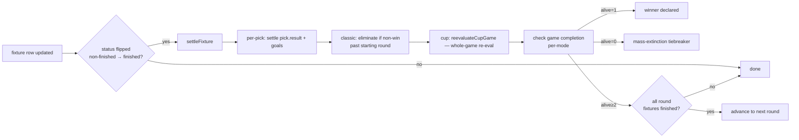
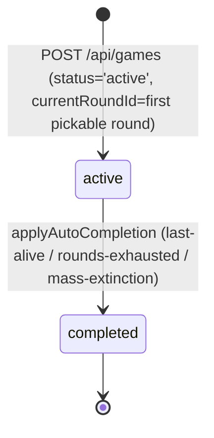
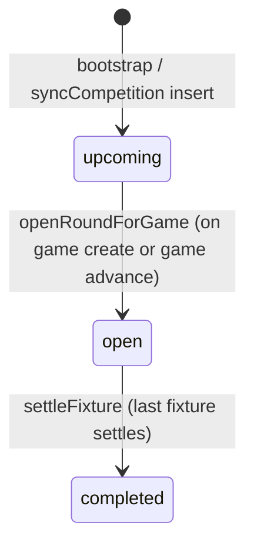
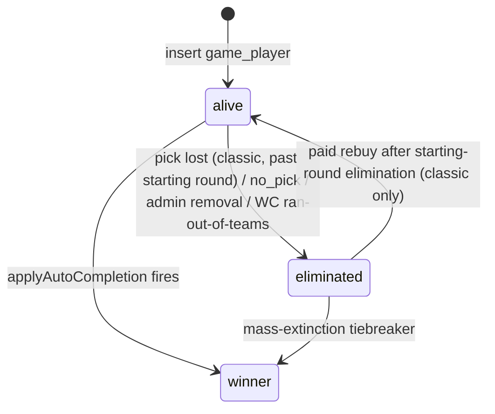

# Game modes — state machines and lifecycle

This directory documents the runtime behaviour of every supported game mode. It is the **authoritative spec**. Code is verified against it; smoke tests in `scripts/smoke/lifecycle.smoke.test.ts` are the executable cross-reference.

Read this README first for the cross-cutting state machines. The per-mode docs below cover anything mode-specific.

- [classic.md](./classic.md) — one pick per round, last person standing
- [turbo.md](./turbo.md) — ten ranked predictions, highest streak wins
- [cup.md](./cup.md) — tier-handicapped knockout with lives system

---

## The settlement model

**The settlement model is per-fixture.** When a fixture transitions to `finished`, every pick on it is settled in the same write — `pick.result` + `goals_scored` (+ `life_gained` / `life_spent` for cup) persist immediately, mode-specific elimination fires (classic), and the game's auto-completion is checked. This matches the predecessor app's `process_pick_results_on_fixture_update` DB trigger.

Round completion is **emergent** — a round becomes `completed` when every fixture in it has been settled. Game advancement happens at the same point.

There is no round-batched processing step. Picks on later-finishing fixtures stay `pending` until their own fixture settles.

## State machines

Four entities, each with their own status. Most operations advance more than one.

| Entity | Field | States |
| --- | --- | --- |
| Game | `game.status` | `setup` → `active` → `completed` (`open` enum value unused in current flows) |
| Round | `round.status` | `upcoming` → `open` → `completed` |
| Player | `game_player.status` | `alive` → `eliminated` OR `alive` → `winner` |
| Pick | `pick.result` | `pending` → `win` / `loss` / `draw` / `saved_by_life` |

### Game state

### Round state

Each game's round flips `open` independently — `openRoundForGame` is called when a game first lands on a round (creation or advance). The flip to `completed` is also per-game: when settleFixture sees the round's last fixture get settled, it marks the round complete and advances the game. Multiple games on the same competition observe the same `round.status` value — that's why pick gating uses `round.deadline`, not `round.status`.

### Player state

### Pick state

`pick.result` defaults to `pending`. Set by `settleFixture` (per-fixture) for classic + turbo, and by `reevaluateCupGame` (whole-game) for cup.

---

## Live experience

There are two complementary mechanisms for the in-progress feel:

### 1. Settled state updates per-fixture

As fixtures finish, their picks settle immediately. The progress grid / cup ladder / turbo standings reflect those settled cells as soon as the next poll-scores observation lands. A player who lost their Saturday pick sees themselves eliminated by Saturday evening — not Monday night.

### 2. Live projection for in-progress fixtures

While a fixture is `live` or `halftime` (kicked off, not yet finished), the server projects what the pick *would* look like if scores stayed:

- **Per pick:** `LivePick.projectedOutcome` (`winning` / `drawing` / `losing` / `saved-by-life` / `settled-win` / `settled-loss` / `pending`).
- **Per player:** `LivePlayer.projectedStreak`, `projectedLivesRemaining`, `projectedStatus`.
- **Cell visuals:** an in-progress pick that's currently winning renders with the **same visual treatment as a settled win**. A currently-losing pick renders as a settled loss. Players orient via fixture status (live ticker / kickoff time / LIVE-HT pill) — the cell colour represents the projected result. Nothing is persisted until the fixture finishes.

Computed entirely server-side in `getLivePayload` (`src/lib/game/detail-queries.ts`). Pure function `projectPickOutcome` lives in `src/lib/live/derive.ts`. No DB writes.

---

## Trigger surfaces

`settleFixture` is called from every site that writes `fixture.status = 'finished'`:

1. **`/api/cron/poll-scores`** — live observation of the non-finished → finished transition during the match window.
2. **`syncCompetition`** (`bootstrap-competitions.ts`) — adapter-mirror state on bootstrap and daily-sync. Captures fixtures the live-poll missed.

Safety nets for anything that slips through:

3. **Game-detail page SSR** — `reconcileGameState(gameId)` runs `sweepGameSettlement` on every viewer hit.
4. **`/api/games/[id]/live`** — every 30 s browser poll while a page is open also runs reconcile.
5. **Daily-sync cron** — `reconcileAllActiveGames` sweeps every active game once per day.
6. **`/api/cron/process-rounds`** — manual ops endpoint (thin wrapper around `reconcileAllActiveGames`).

All five paths converge on `settleFixture` for the actual work. Settlement is idempotent on every axis: re-running on a settled pick is a no-op (guard on `pick.result !== 'pending'`); re-running elimination guards on `gamePlayer.status === 'alive'`; cup re-eval is naturally idempotent (same inputs → same writes).

---

## Verifying the spec

`scripts/smoke/lifecycle.smoke.test.ts` is the executable cross-reference. Each scenario seeds real DB rows, drives finished/live fixture status writes through `settleFixture` (or `getLivePayload` for projection cases), and asserts settled pick state + projected aggregates.

CI runs the smoke suite against a real Postgres after the unit suite. Local: `just smoke`.

If you change a state machine in code, you must:
- Update the per-mode doc (`classic.md` / `turbo.md` / `cup.md`).
- Update the corresponding smoke scenario.

See [AGENTS.md → Adding a new competition](../../AGENTS.md#adding-a-new-competition) for the checklist.
