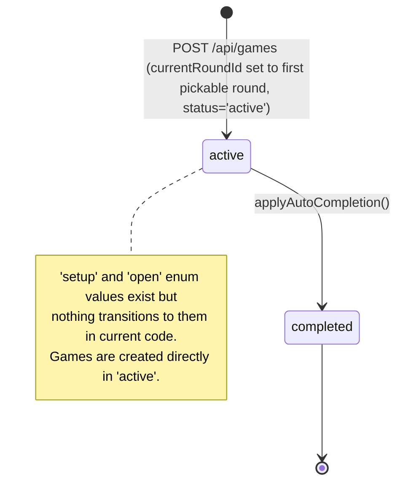
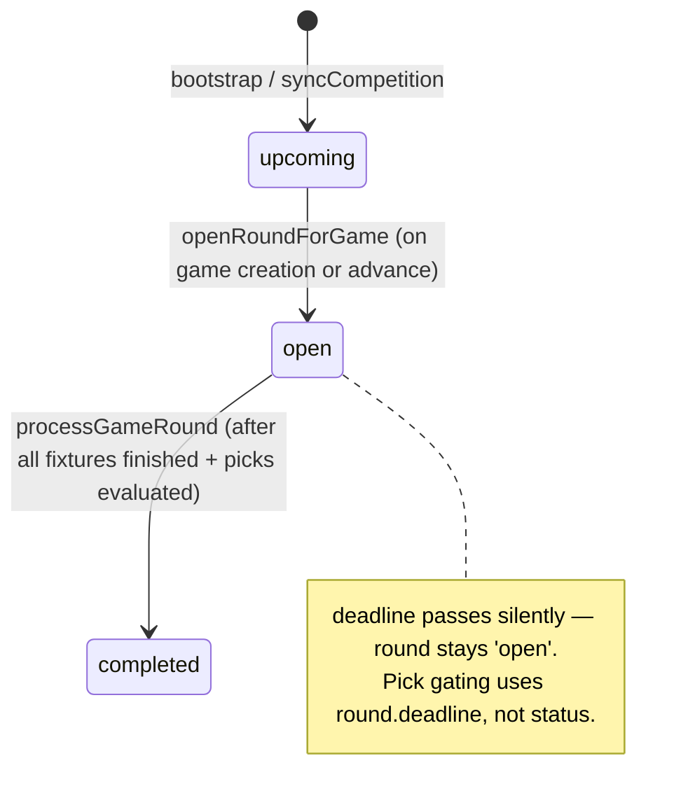
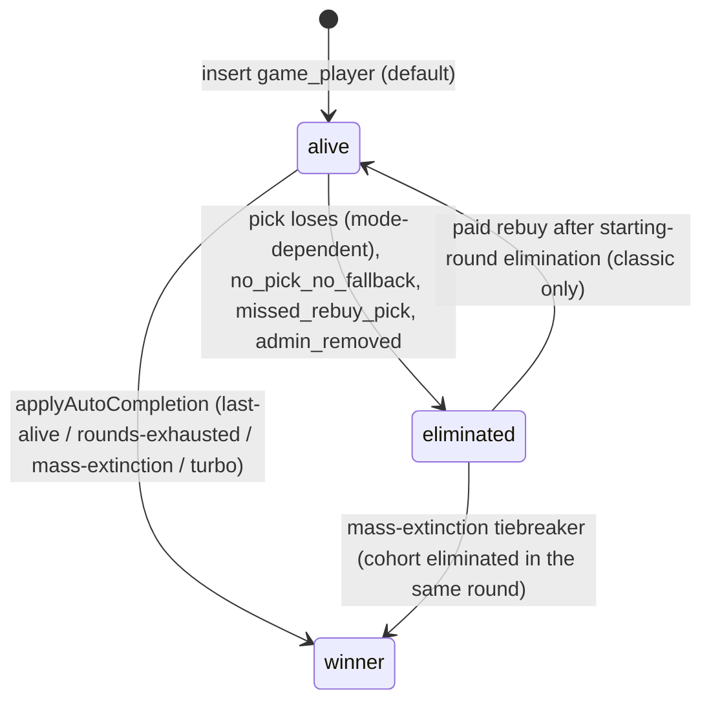
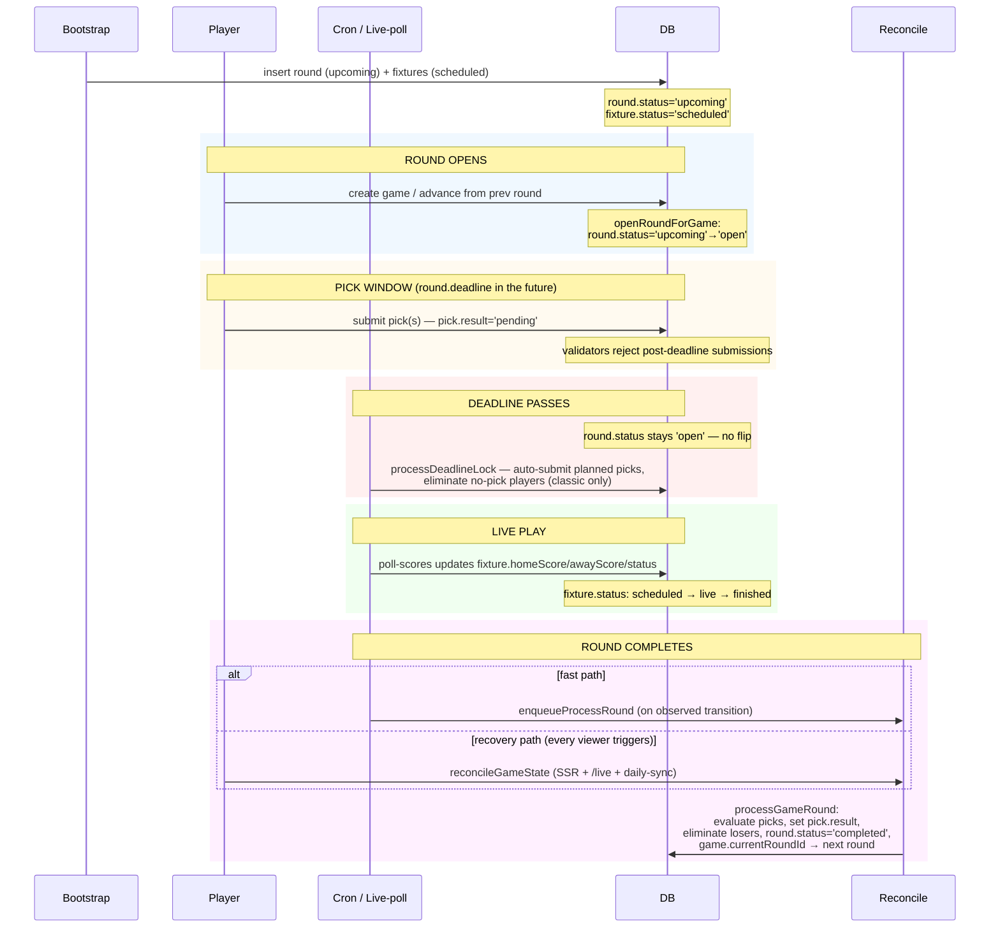

# Game modes — state machines and lifecycle

This directory documents the runtime behaviour of every supported game mode. It is the **authoritative spec** for the rules — code is verified against it (see "Verifying the spec" below).

Read this README first for the cross-cutting state machines. The per-mode docs below cover anything mode-specific (eliminations, picks, lives, auto-completion).

- [classic.md](./classic.md) — one pick per round, last person standing
- [turbo.md](./turbo.md) — ten ranked predictions, highest streak wins
- [cup.md](./cup.md) — tier-handicapped knockout with lives system

---

## Concepts

Four state machines run in parallel. Most operations advance more than one of them.

| Entity | Field | States | Granularity |
| --- | --- | --- | --- |
| Game | `game.status` | `setup` → `active` → `completed` (the `open` enum value is unused in current flows) | one per game |
| Round | `round.status` | `upcoming` → `open` → `completed` (the `active` enum value is unused) | one per round per competition (shared across games on that competition) |
| Player | `game_player.status` | `alive` → `eliminated` OR `alive` → `winner` | one per player per game |
| Pick | `pick.result` | `pending` → `win` / `loss` / `draw` / `saved_by_life` | one per pick |

### Game state

- **Creation**: `src/app/api/games/route.ts` inserts with `status: 'active'`.
- **Completion**: `applyAutoCompletion` (`src/lib/game/auto-complete.ts:157`) sets `status: 'completed'` and `currentRoundId: null` after the last-alive / mass-extinction / rounds-exhausted / turbo-single-round conditions fire.

### Round state

A round is shared across every game on its competition, but **the open / completed transition is per-game-driven**. A round flips to `open` when the *first* game advances into it, and flips to `completed` when *any* game finishes processing it. Multiple games on the same competition see the same `round.status` even if they're at different points in their own lifecycle — that's why progress gating (pick deadlines, planner availability) reads `game.currentRoundId` + `round.deadline`, not `round.status`.

- **Insert**: `syncCompetition` (`src/lib/game/bootstrap-competitions.ts:253`) creates rounds in `upcoming`, mirrors `completed` from the adapter when every fixture is finished.
- **Open**: `openRoundForGame` (`src/lib/game/round-lifecycle.ts:18`), called by game creation and `advanceGameToNextRound`.
- **Complete**: `processGameRound` (`src/lib/game/process-round.ts:79`) sets `status: 'completed'` after picks are evaluated.

### Player state

- **Eliminated**: `processGameRound` per-mode + `processDeadlineLock` (no-pick handler).
- **Rebuy**: `src/app/api/games/[id]/rebuy/route.ts` — only valid in classic mode with `modeConfig.allowRebuys=true`, and only between round 1 and round 2.
- **Winner**: `applyAutoCompletion` (`src/lib/game/auto-complete.ts:163`).

### Pick state

`pick.result` is `pending` from insert until the round is processed. Mode-specific evaluators (`processClassicRound`, `evaluateTurboPicks`, `evaluateCupPicks`) set the final value.

---

## Gameweek (round) lifecycle

Every game mode shares this sequence per gameweek. Differences live in the "process the round" step.

### Trigger paths in detail

`processGameRound` is the leaf function that does the actual work. It is reached via:

1. **Fast path (live-poll observes transition):** `/api/cron/poll-scores` writes a fixture row, notices `existing.status !== 'finished' && score.status === 'finished'`, and if every fixture in the round is finished it calls `enqueueProcessRound`. The QStash handler (`/api/cron/qstash-handler`) then invokes `processGameRound`. This is the fastest path during a live match window.

2. **Recovery: page SSR** — every render of `/game/[id]` calls `reconcileGameState`. Self-healing for any user who looks at the game.

3. **Recovery: live API** — `/api/games/[id]/live` calls `reconcileGameState` before computing the payload. The browser polls this every 30 s while a game page is open.

4. **Recovery: daily-sync cron** — `reconcileAllActiveGames` runs at 04:00 UTC. Catches games no one has viewed since their round finished.

5. **Manual: `/api/cron/process-rounds`** — same code path, exposed for ops debugging.

The fast path can miss the transition if `syncCompetition` writes `fixture.status='finished'` before live-poll observes it (e.g. a fixture finished while the chain was dormant). That's why recovery paths exist — and why every recovery call is idempotent (round `'completed'` short-circuit in `processGameRound`).

---

## Verifying the spec

The smoke harness (`scripts/smoke/lifecycle.smoke.test.ts`) is the executable cross-reference between this doc and the code. Every documented state transition has at least one scenario that:

1. Seeds the precondition (rounds, fixtures, picks).
2. Writes final scores directly to fixture rows — deliberately the missed-transition path.
3. Calls `reconcileGameState` and asserts the post-transition state.

If you change a state machine in code, you must update both the per-mode doc and the corresponding smoke scenario. CI runs the smoke harness against a real Postgres; type-checked unit tests by themselves are insufficient.

See [AGENTS.md → Adding a new competition](../../AGENTS.md#adding-a-new-competition) for the checklist.
