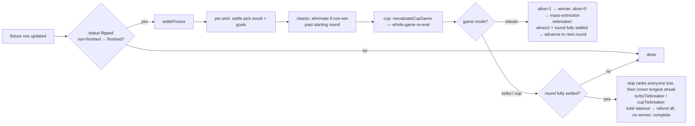
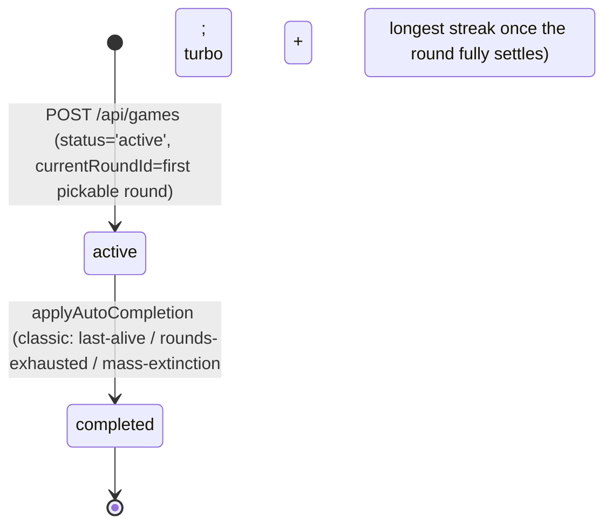
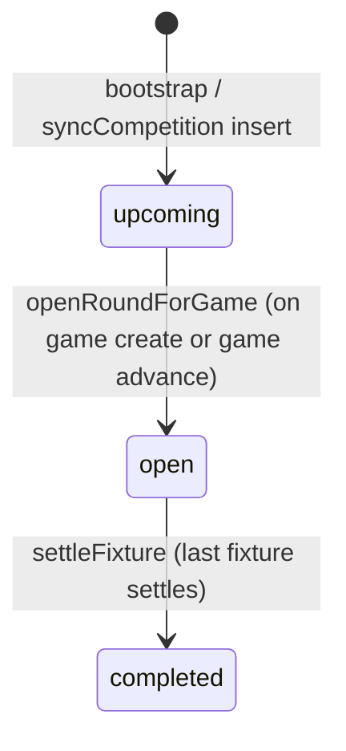
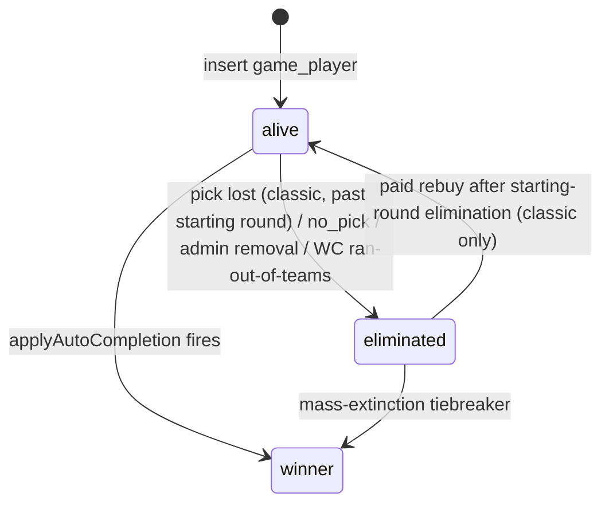

# Game modes — state machines and lifecycle

This directory documents the runtime behaviour of every supported game mode. It is the **authoritative spec**. Code is verified against it; smoke tests in `scripts/smoke/lifecycle.smoke.test.ts` are the executable cross-reference.

Read this README first for the cross-cutting state machines. The per-mode docs below cover anything mode-specific.

## Modes at a glance

| Mode | Rounds/game | Picks | Wins by | Eliminations? |
|---|---|---|---|---|
| [**classic**](./classic.md) | **many** (advances round→round) | 1 team/round | last player still alive | yes — a non-win knocks you out |
| [**turbo**](./turbo.md) | **1** | N, confidence-ranked | longest streak of correct picks | no |
| [**cup**](./cup.md) | **1** | up to N (partial ok) | longest streak of correct picks | no — lives extend the streak |

`classic` is the only multi-round mode. `turbo` and `cup` play a single round (one gameweek) and crown the longest streak of correct picks; `cup` adds a tier handicap (pick underdogs or level ties, never a big favourite) and lives (underdog wins earn them; a life saves one wrong call to keep your streak alive).

---

## The settlement model

**The settlement model is per-fixture.** When a fixture transitions to `finished`, every pick on it is settled in the same write — `pick.result` + `goals_scored` (+ `life_gained` / `life_spent` for cup) persist immediately, mode-specific elimination fires (classic), and the game's auto-completion is checked. This matches the predecessor app's `process_pick_results_on_fixture_update` DB trigger.

Round completion is **emergent** — a round becomes `completed` when every fixture in it has been settled. At that point **classic** advances to the next round; **turbo** and **cup** auto-complete on the longest streak (they play a single round) — or refund everyone with no winner if every player got every pick wrong (a total wipeout).

There is no round-batched processing step. Picks on later-finishing fixtures stay `pending` until their own fixture settles.

```mermaid
flowchart LR
    A[fixture row updated] --> B{status flipped<br/>non-finished → finished?}
    B -->|no| Z[done]
    B -->|yes| C[settleFixture]
    C --> D[per-pick: settle pick.result + goals]
    D --> E[classic: eliminate if non-win<br/>past starting round]
    E --> F[cup: reevaluateCupGame — whole-game re-eval]
    F --> G{game mode?}
    G -->|classic| Gc[alive=1 → winner; alive=0 → mass-extinction tiebreaker;<br/>alive≥2 + round fully settled → advance to next round]
    G -->|turbo / cup| J{round fully settled?}
    J -->|yes| K[skip ranks everyone lost, then crown longest streak<br/>turboTiebreaker / cupTiebreaker;<br/>total wipeout → refund all, no winner; complete]
    J -->|no| Z
```

## State machines

Four entities, each with their own status. Most operations advance more than one.

| Entity | Field | States |
| --- | --- | --- |
| Game | `game.status` | `setup` → `active` → `completed` (`open` enum value unused in current flows) |
| Round | `round.status` | `upcoming` → `open` → `completed` |
| Player | `game_player.status` | `alive` → `eliminated` OR `alive` → `winner` |
| Pick | `pick.result` | `pending` → `win` / `loss` / `draw` / `saved_by_life` |

### Game state

```mermaid
stateDiagram-v2
    [*] --> active: POST /api/games (status='active', currentRoundId=first pickable round)
    active --> completed: applyAutoCompletion (classic: last-alive / rounds-exhausted / mass-extinction;<br/>turbo + cup: longest streak once the round fully settles)
    completed --> [*]
```

### Round state

Each game's round flips `open` independently — `openRoundForGame` is called when a game first lands on a round (creation or, for classic, advance). The flip to `completed` is also per-game: when settleFixture sees the round's last fixture settle, it marks the round complete — which advances classic to the next round, or completes the game for turbo/cup. Multiple games on the same competition observe the same `round.status` value — that's why pick gating uses `round.deadline`, not `round.status`.

```mermaid
stateDiagram-v2
    [*] --> upcoming: bootstrap / syncCompetition insert
    upcoming --> open: openRoundForGame (on game create or game advance)
    open --> completed: settleFixture (last fixture settles)
```

### Player state

```mermaid
stateDiagram-v2
    [*] --> alive: insert game_player
    alive --> eliminated: pick lost (classic, past starting round) / no_pick / admin removal / WC ran-out-of-teams
    alive --> winner: applyAutoCompletion fires
    eliminated --> winner: mass-extinction tiebreaker
    eliminated --> alive: paid rebuy after starting-round elimination (classic only)
```

### Pick state

`pick.result` defaults to `pending`. Set by `settleFixture` (per-fixture) for classic + turbo, and by `reevaluateCupGame` (whole-game) for cup.

---

## Live experience

There are two complementary mechanisms for the in-progress feel:

### 1. Settled state updates per-fixture

As fixtures finish, their picks settle immediately. The progress grid / cup ladder / turbo standings reflect those settled cells as soon as the next poll-scores observation lands. A player who lost their Saturday pick sees themselves eliminated by Saturday evening — not Monday night.

### 2. Live projection for in-progress fixtures

While a fixture is `live` or `halftime` (kicked off, not yet finished), the server projects what the pick *would* look like if scores stayed:

- **Per pick:** `LivePick.projectedOutcome` (`winning` / `drawing` / `losing` / `saved-by-life` / `settled-win` / `settled-loss` / `pending`).
- **Per player:** `LivePlayer.projectedStreak`, `projectedLivesRemaining`, `projectedStatus`.
- **Cell visuals:** an in-progress pick that's currently winning renders with the **same visual treatment as a settled win**. A currently-losing pick renders as a settled loss. Players orient via fixture status (live ticker / kickoff time / LIVE-HT pill) — the cell colour represents the projected result. Nothing is persisted until the fixture finishes.

Computed entirely server-side in `getLivePayload` (`src/lib/game/detail-queries.ts`). Pure function `projectPickOutcome` lives in `src/lib/live/derive.ts`. No DB writes.

---

## Trigger surfaces

`settleFixture` is called from every site that writes `fixture.status = 'finished'`:

1. **`/api/cron/poll-scores`** — live observation of the non-finished → finished transition during the match window.
2. **`syncCompetition`** (`bootstrap-competitions.ts`) — adapter-mirror state on bootstrap and daily-sync. Captures fixtures the live-poll missed.

Safety nets for anything that slips through:

3. **Game-detail page SSR** — `reconcileGameState(gameId)` runs `sweepGameSettlement` on every viewer hit.
4. **`/api/games/[id]/live`** — every 30 s browser poll while a page is open also runs reconcile.
5. **Daily-sync cron** — `reconcileAllActiveGames` sweeps every active game once per day. This pass also runs `sweepStuckFixtures` first: an all-rounds sweep for pending picks on fixtures in a **terminal** state — `finished` **or** `cancelled` — so both stranding modes self-heal within a day, with the work applied to the round the fixture belongs to.
   - *Finished:* a pick stranded behind an already-advanced game (a deferred knockout tie whose winner arrived late) settles, and the elimination lands in the tie's own round.
   - *Cancelled:* a pick left pending because the inline void was missed gets voided. Cancellations are in scope because such a pick doesn't merely strand — it **pins the game**: `reconcileGameState` early-returns a data-source-completed round straight to the gated advancement (which the pending pick blocks), so the per-game pass never reaches `sweepGameSettlement`, the only other cancellation-aware path.
   - Telemetry note: `stuckFixturesSettled` counts void-only work too, so a non-zero value doesn't imply any pick was scored.
6. **`/api/cron/process-rounds`** — manual ops endpoint (thin wrapper around `reconcileAllActiveGames`).

All of these paths converge on `settleFixture` for the actual work. Advancement is double-gated on pending picks: neither the settle path (`checkAndMaybeCompleteOrAdvance`) nor the reconcile path (`advanceGameIfReady`) will advance a game while its current round has a pending pick for that game — a data-source-completed round can still hold a deferred knockout pick. And a late settle in a round the game already moved past never touches `game.currentRoundId` (the settle path only advances when the settled round IS the game's current round). Settlement is idempotent on every axis: re-running on a settled pick is a no-op (guard on `pick.result !== 'pending'`); re-running elimination guards on `gamePlayer.status === 'alive'`; cup re-eval is naturally idempotent (same inputs → same writes).

### The deadline no-pick lock

`processDeadlineLock` (`src/lib/game/no-pick-handler.ts`) handles alive players who made no pick once a round's deadline passes: classic round 3+ gets the worst-placed unused team auto-assigned (or elimination when every round team is already used); classic rounds 1–2 and turbo/cup eliminate per their mode rules. It is idempotent and internally gated on `round.deadline <= now`, so every surface calls it unconditionally:

1. **QStash `deadline_lock` job** — scheduled by `openRoundForGame` for deadline+30s (same surface that pre-schedules auto-submits; dedup id collapses concurrent games opening the same round). This is the primary path: no-pick processing lands minutes after the deadline, before any fixture kicks off.
2. **Daily-sync cron** — `syncCompetition` reports deadline-passed open rounds; the route runs the lock over them as the idempotent fallback.
3. **Crown guard** — `checkAndMaybeCompleteOrAdvance` (the settle path's completion check) runs the lock for the settling round before evaluating ANY completion. No completion path (last-alive, mass-extinction, rounds-exhausted, turbo/cup crowning) can declare winners while an alive player's no-pick processing is outstanding — a pickless finalist is eliminated before the winner evaluation sees them (the WC LPS split-pot incident, which raced the final's settlement against the next morning's daily sync).

---

## Verifying the spec

`scripts/smoke/lifecycle.smoke.test.ts` is the executable cross-reference. Each scenario seeds real DB rows, drives finished/live fixture status writes through `settleFixture` (or `getLivePayload` for projection cases), and asserts settled pick state + projected aggregates.

CI runs the smoke suite against a real Postgres after the unit suite. Local: `just smoke`.

If you change a state machine in code, you must:
- Update the per-mode doc (`classic.md` / `turbo.md` / `cup.md`).
- Update the corresponding smoke scenario.

See [AGENTS.md → Adding a new competition](../../AGENTS.md#adding-a-new-competition) for the checklist.
