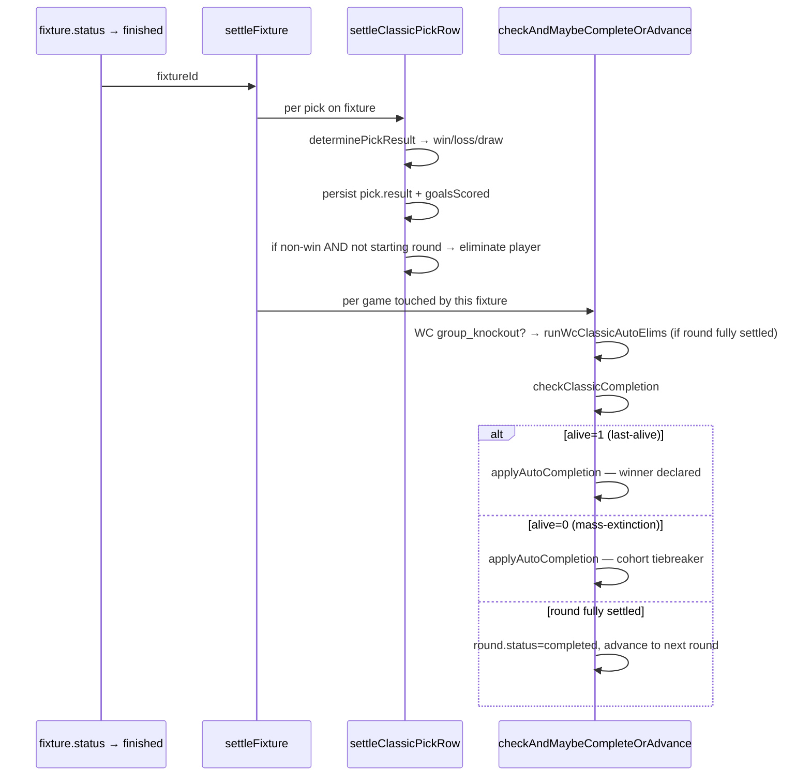
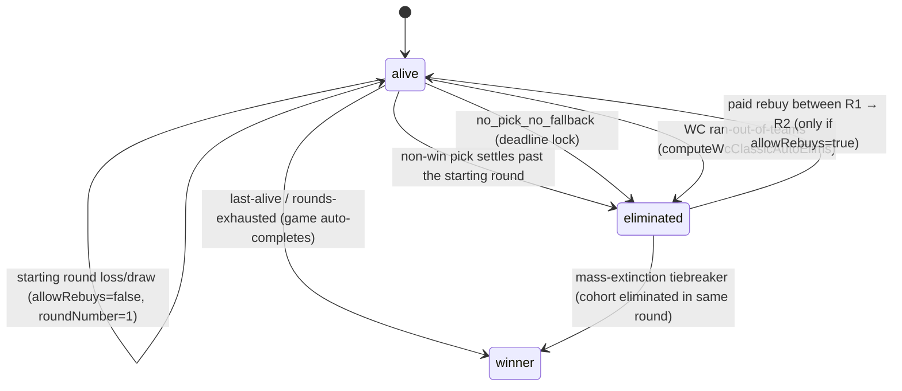

# Classic mode

Last person standing. One pick per round; if your team doesn't win, you're out.

> Read [README.md](./README.md) first for the cross-cutting settlement model and state machines.

## Pick mechanics

- **Pick:** exactly one team per round. Stores `teamId` + `fixtureId` (so multi-fixture-per-team rounds — e.g. a PL gameweek with a rearranged Saturday match — are deterministic).
- **Win condition:** picked team wins their fixture. A draw is a loss *except* in the **starting round** (round 1 of a no-rebuys game).
- **Team re-use:** a team can only be picked once per player per game.
- **WC-specific:** picking a knockout team that's been eliminated from the tournament is invalid (`team-tournament-eliminated`). Players who run out of pickable teams in remaining rounds are auto-eliminated by `computeWcClassicAutoElims`, fired after the round's last fixture settles.

## Settlement (per fixture)

`settleFixture` (`src/lib/game/settle.ts`) dispatches each pick on the just-finished fixture through `settleClassicPickRow`:



Pick result mapping:
- `pickedTeam wins fixture` → `pick.result = 'win'`, `goalsScored = pickedTeamGoals`
- `pickedTeam loses` → `pick.result = 'loss'`, `goalsScored = 0`
- `fixture draws` → `pick.result = 'draw'`, `goalsScored = 0`. The progress grid renders draws as `draw_exempt` in the starting round (round 1, no rebuys) and as `loss` everywhere else.

## Player state machine (classic-specific)



**Starting-round exemption:** `roundData.number === 1 && !allowRebuys` → losses/draws don't eliminate. Encoded in `settleClassicPickRow`.

**Mid-gameweek eliminations are real.** A player whose pick lost a Saturday fixture is `eliminated` Saturday evening, before Sunday/Monday fixtures play. The next page-view will reflect it.

**Mid-gameweek auto-completion is also real.** If a fixture's settlement drops the alive count to 1, the game auto-completes immediately — no waiting for the round to finish.

## Live projection

For an in-progress fixture (status=`live`/`halftime`, scores present):

- **Per pick:** `LivePick.projectedOutcome` is `winning` / `losing` / `drawing` based on current score.
- **Per player:** `LivePlayer.projectedStatus` is `eliminated` if any in-progress pick is currently losing AND it's past the starting round. Otherwise `alive`.
- **Cell visuals:** `getProgressGridData` projects in-progress pick cells using `projectClassicCellFromFixture`. A pick whose fixture is `live` and currently `2-0` renders as the green `'win'` cell — same visual as a settled win.

## Pick validation

`validateClassicPick` (`src/lib/picks/validate.ts:18`):
- Player must be `alive` (or `allowEliminatedRebuy=true` on the rebuy path).
- Round must be the game's current round.
- `now <= deadline` (deadline null is fine — knockout rounds pre-bracket).
- Team must not be in `usedTeamIds` for this player.
- Team must be playing in this round.

For `group_knockout` comps, also `validateWcClassicPick`: blocks picks of teams already knocked out.

## Mode config

```ts
{
  allowRebuys?: boolean // default false; if true, R1 losses can pay to re-enter
}
```

## Smoke coverage

`scripts/smoke/lifecycle.smoke.test.ts`, `lifecycle: classic-PL` + `lifecycle: classic-WC`:

- Single-fixture-of-many settles immediately; other picks stay pending.
- Mid-gameweek elimination (3 players, one loses on first fixture → eliminated before remaining fixtures finish).
- Mid-gameweek auto-completion (2 players, alive=1 after one fixture → game completes).
- Round advancement on last-fixture settle (3 winners → all advance).
- WC group-stage settle + advance.
- Live projection: in-progress fixture surfaces projected `'alive'` / `'eliminated'` per player + `'winning'` / `'losing'` per pick.

Not yet covered (gaps to fill):
- WC knockout auto-elimination via `computeWcClassicAutoElims`.
- Mass-extinction tiebreaker.
- `processDeadlineLock` end-to-end.
- Rebuy round R1 → R2.
