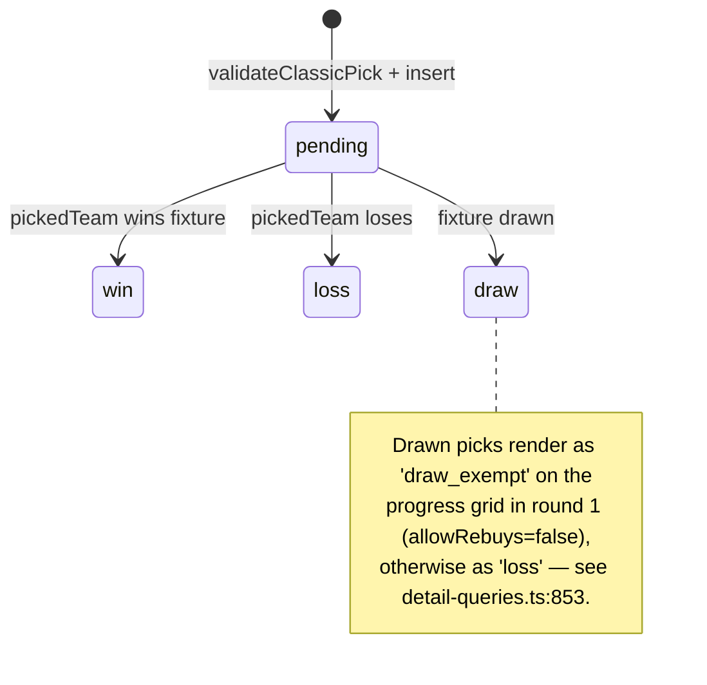
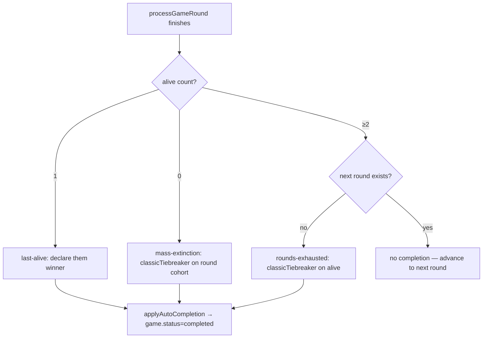

# Classic mode

Last person standing. One pick per round; if your team doesn't win, you're out.

> Read [README.md](./README.md) first for the cross-cutting state machines.

## Game shape

- **Pick:** exactly one team per round. The pick stores `teamId` and `fixtureId` (so multi-fixture-per-team rounds — e.g. a PL gameweek with a rearranged Saturday match — are deterministic).
- **Round:** one gameweek (PL) or one matchday (WC). All fixtures must finish before the round is processed.
- **Win condition:** picked team wins their fixture. A draw counts as a loss *except* in the **starting round** (round 1 of a no-rebuys game).
- **Re-using teams:** a team can only be picked once per game per player.
- **WC-specific:** picking a knockout team that's been eliminated from the tournament is invalid (`team-tournament-eliminated`). Players who run out of pickable teams in remaining rounds are auto-eliminated (`computeWcClassicAutoElims`).

## Pick state machine



Result is set inside `processClassicRound` (`src/lib/game-logic/classic.ts:42`) and persisted by `processGameRound` (`src/lib/game/process-round.ts:138-145`).

## Player state machine (classic-specific)

```mermaid
stateDiagram-v2
    [*] --> alive
    alive --> alive: starting round loss/draw (allowRebuys=false, roundNumber=1)
    alive --> eliminated: loss/draw outside starting round
    alive --> eliminated: no_pick_no_fallback (deadline passed, no submitted pick)
    alive --> eliminated: missed_rebuy_pick (post-rebuy round, no pick)
    alive --> eliminated: ran-out-of-teams (WC only — every remaining fixture has only used/knocked-out teams)
    eliminated --> alive: paid rebuy between round 1 → round 2 (only if allowRebuys=true)
    alive --> winner: last-alive / rounds-exhausted (game auto-completes)
    eliminated --> winner: mass-extinction tiebreaker (cohort eliminated in the same round; classicTiebreaker chooses by total winning goals)
```



`processClassicRound` returns `eliminated: result !== 'win' && !isStartingRound`. `isStartingRound` is true when `roundData.number === 1 && allowRebuys === false`.

## Round lifecycle (classic-specific bits)

The cross-cutting round flow is the same as documented in the README. Three things matter specifically to classic:

1. **Deadline lock.** `processDeadlineLock` (`src/lib/game/no-pick-handler.ts`) is invoked from daily-sync when a round's deadline has just passed. It auto-submits any `planned_pick` rows marked `autoSubmit=true` and eliminates classic players with no pick + no fallback. Other modes don't go through this — turbo and cup require explicit submission.
2. **Multi-fixture-per-team.** When a team appears in more than one fixture in a round (PL rescheduling), `resolveFixture` in `classic.ts:49-60` prefers `pick.pickedFixtureId` and falls back to the first matching fixture in kickoff order. The fixture-id is captured at pick time so the result is deterministic even after later reschedules.
3. **WC auto-elimination.** Group-stage rounds (1-3) and knockout rounds (16, QF, SF, F) all use the same classic flow, plus the additional `computeWcClassicAutoElims` pass after `processClassicRound` to eliminate players who can't pick anything in the remaining rounds.

## Game auto-completion conditions

Evaluated by `checkClassicCompletion` (`src/lib/game/auto-complete.ts:76`) after every processed round.



**Mass-extinction cohort.** When `alive.length === 0`, only players whose `eliminatedRoundId` matches the just-completed round are considered for the tiebreaker — earlier-round eliminations are excluded. `classicTiebreaker` picks the cohort member(s) with the highest total winning-team goals across the whole game.

## Pick validation

`validateClassicPick` (`src/lib/picks/validate.ts:18`):

- Player must be `alive` (or `allowEliminatedRebuy=true` on the rebuy path).
- Round must be the game's current round.
- `now <= deadline` (deadline null is fine — knockout rounds pre-bracket-publication).
- Team must not be in `usedTeamIds` for this player.
- Team must be one of the round's fixture-team-ids.

The API route additionally runs `validateWcClassicPick` for `competition.type === 'group_knockout'`, blocking picks of teams already eliminated from the knockout bracket.

## Mode config

```ts
{
  allowRebuys?: boolean // default false; if true, R1 losses can pay to re-enter
}
```

## Smoke coverage

`scripts/smoke/lifecycle.smoke.test.ts` — `lifecycle: classic-PL` + `lifecycle: classic-WC`:

- "reconciles + processes a finished round (missed-transition path)" — full happy path including R1 draw-exempt, multi-pick game, advancement to R2.
- "eliminates on loss after the starting round" — 3 players (so alive>1, no auto-complete), loser picker eliminated.
- "processes a group-stage round and advances" — WC equivalent on `group_knockout`.

Not yet covered (gaps to fill):

- WC knockout auto-elimination via `computeWcClassicAutoElims`.
- Mass-extinction tiebreaker on classic.
- `processDeadlineLock` end-to-end (no-pick → eliminated).
- Rebuy round between R1 → R2.
