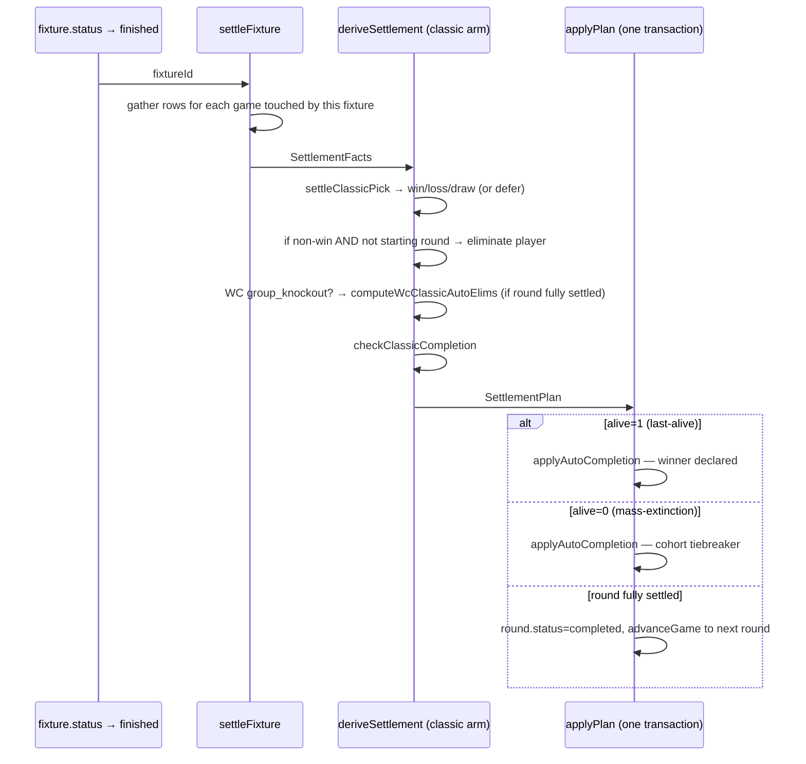
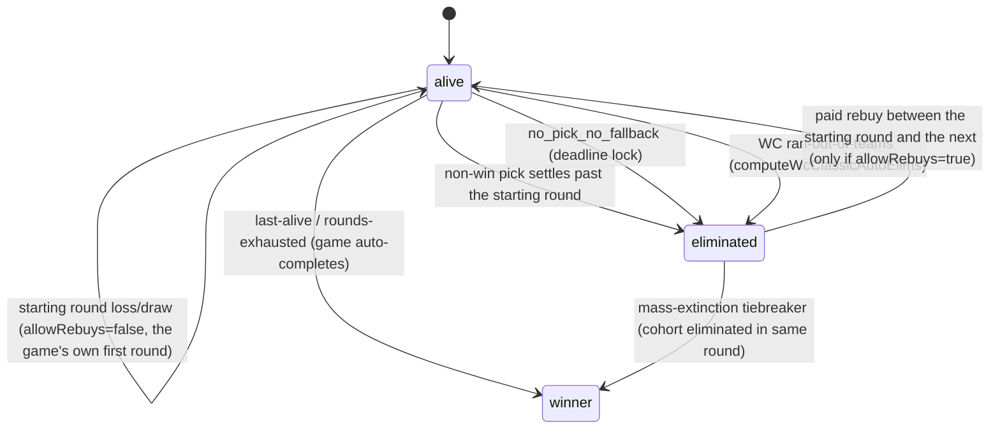

# Classic mode

Last person standing, played over **many rounds** — the only multi-round mode. One pick per round; if your team doesn't win, you're out; survive and you advance to the next round.

> Read [README.md](./README.md) first for the cross-cutting settlement model and state machines.

## The starting round

**The starting round is the round the *game* was played from — its own round one — not the competition's gameweek one.** Game creation attaches a new game to the competition's earliest still-pickable round, so a game created in November opens at gameweek 12, and gameweek 12 is the first hurdle its players are put to. Everything below that says "the starting round" means that round, whatever the competition numbers it.

It's recorded on `game.starting_round_id`, written at creation and never moved (`current_round_id` advances as the game goes on, so it can't answer this). `src/lib/game/starting-round.ts` is the only place it's resolved: `isGameStartingRound` for "is this the starting round?" and `resolveRoundAfterStarting` for the round after it — the rebuy window's closing deadline, resolved on the competition's round sequence rather than as `number + 1`. **"The round after the starting round" is what used to be called "round 2" throughout this document.**

Every rule keys off it: the settle exemption (`settleClassicPick`), both rebuy routes and the rebuy offer, the deadline lock's opening/second-round branches (`processDeadlineLock`), the progress grid's marker and `draw_exempt` rendering, the live projection (`projectClassicPlayer`) and the hero's exemption state (`buildGameView`). Keying any of them off `round.number === 1` gave a mid-season game no exemption and no possible rebuy however `allowRebuys` was set — see #203. The player's own summary reads the same round for its opening-round block (`buildClassicRoundOne`).

A game with no starting round recorded has no starting round at all: no exemption, no rebuy, no marker. After #203's backfill that can't be a game the app created.

## Pick mechanics

- **Pick:** exactly one team per round. Stores `teamId` + `fixtureId` (so multi-fixture-per-team rounds — e.g. a PL gameweek with a rearranged Saturday match — are deterministic).
- **Win condition:** picked team wins their fixture. A draw is a loss *except* in the **starting round** (the game's own first round, in a no-rebuys game).
- **Team re-use:** a team can only be picked once per player per game.
- **WC-specific:** picking a knockout team that's been eliminated from the tournament is invalid (`team-tournament-eliminated`). Players who run out of pickable teams in remaining rounds are auto-eliminated by `computeWcClassicAutoElims`, fired after the round's last fixture settles.

## Settlement (per fixture)

`settleFixture` (`src/lib/game/settle.ts`) gathers the rows, `deriveSettlement` (`src/lib/game/settlement-plan.ts`) decides the whole outcome with no database in reach, and `applyPlan` writes it in one transaction:


```mermaid
sequenceDiagram
    participant Trigger as fixture.status → finished
    participant Settle as settleFixture
    participant Derive as deriveSettlement (classic arm)
    participant Apply as applyPlan (one transaction)

    Trigger->>Settle: fixtureId
    Settle->>Settle: gather rows for each game touched by this fixture
    Settle->>Derive: SettlementFacts
    Derive->>Derive: settleClassicPick → win/loss/draw (or defer)
    Derive->>Derive: if non-win AND not starting round → eliminate player
    Derive->>Derive: WC group_knockout? → computeWcClassicAutoElims (if round fully settled)
    Derive->>Derive: checkClassicCompletion
    Derive->>Apply: SettlementPlan
    alt alive=1 (last-alive)
        Apply->>Apply: applyAutoCompletion — winner declared
    else alive=0 (mass-extinction)
        Apply->>Apply: applyAutoCompletion — cohort tiebreaker
    else round fully settled
        Apply->>Apply: round.status=completed, advanceGame to next round
    end
```

Pick result mapping:
- `pickedTeam wins fixture` → `pick.result = 'win'`, `goalsScored = pickedTeamGoals`
- `pickedTeam loses` → `pick.result = 'loss'`, `goalsScored = 0`
- `fixture draws` → `pick.result = 'draw'`, `goalsScored = 0`. The progress grid renders draws as `draw_exempt` in the starting round (the game's own first round) and as `loss` everywhere else.

## Player state machine (classic-specific)


```mermaid
stateDiagram-v2
    [*] --> alive
    alive --> alive: starting round loss/draw (allowRebuys=false, the game's own first round)
    alive --> eliminated: non-win pick settles past the starting round
    alive --> eliminated: no_pick_no_fallback (deadline lock)
    alive --> eliminated: WC ran-out-of-teams (computeWcClassicAutoElims)
    eliminated --> alive: paid rebuy between the starting round and the next (only if allowRebuys=true)
    alive --> winner: last-alive / rounds-exhausted (game auto-completes)
    eliminated --> winner: mass-extinction tiebreaker (cohort eliminated in same round)
```

**One survival rule, shared with the projections.** `settleClassicPick` (`src/lib/game/classic-survival.ts`) answers whether a pick came through and whether the result eliminates. The settle path calls it, and so do the progress grid's cell projection, the live payload's per-pick and per-player projections (`detail-queries.ts`) and the pop-out's `projectPickOutcome` (`live/derive.ts`) — a projection calls its scoring half, `resolveClassicPickResult`. That is why the live payload carries each fixture's sides, its `winner` and whether its round is a knockout tie. Before #242 the three projections decided on the score alone, so a tie won on penalties rendered as a loss (and an elimination) beside a settlement scoring it a win.

**Starting-round exemption:** `isGameStartingRound(game, round.id) && !allowRebuys` → losses/draws don't eliminate. Encoded in `settleClassicPick`, so the exemption reads the same on the grid and in the live view as it settles; the round is the game's own first (see [The starting round](#the-starting-round)), so a game created mid-season is exempt on the gameweek it started at.

**Mid-gameweek eliminations are real.** A player whose pick lost a Saturday fixture is `eliminated` Saturday evening, before Sunday/Monday fixtures play. The next page-view will reflect it.

**Mid-gameweek auto-completion is also real.** If a fixture's settlement drops the alive count to 1, the game auto-completes immediately — no waiting for the round to finish.

**Deferred knockout ties can't strand picks.** A knockout tie that finishes level with no `winner` reported (football-data winner-lag) leaves its pick `pending` rather than scoring a draw (`settleClassicPick`'s `defer`, which the projections read too: neither the grid nor the live view shows such a pick settled, or its backer out). Advancement is gated on those picks at BOTH advancement sites — the settle path and reconcile's `advanceGameIfReady` — even when the data source marks the round completed. If a pick was stranded anyway (the game advanced before the gates existed), the daily reconcile's all-rounds `sweepStuckFixtures` settles it once the winner lands: the elimination is applied to the round the tie belongs to, later pick rows stay untouched, and the game's current round pointer never moves backwards.

**A pick left pending on any terminal fixture self-heals.** The same sweep covers `cancelled` fixtures, not just winner-lag ties — see the [Cancellation](#cancellation) section for why a missed void is the more urgent case.

**No-pick processing runs at the deadline, not the next morning.** `processDeadlineLock` fires via a QStash `deadline_lock` job scheduled by `openRoundForGame` for deadline+30s: no-pickers get the worst unused team auto-assigned (`isAuto=true`) — `pickWorstUnusedTeam` reads the **market** first (the longest-odds team among those the round holds a `fixture_odds` row for, the same frozen prices the round summary and the live chip read) and falls back to **league position** only where the round carries no price at all, which is whole competitions rather than the odd fixture: the World Cup and the FA Cup have none. A partly-priced round decides on its priced teams alone, because a probability and a table place can't be compared. Position alone was fragile in early season, where one heavy defeat puts a good side bottom, and it broke the source's tied positions on team id, or are eliminated (`no_pick_no_fallback`) when every team in the round is already used. The game's own starting round is the one exception, and the round after it is a *split*:

- **Starting round:** rebuys off → the exemption applies, nothing happens. Rebuys on → eliminated `no_pick_no_fallback`, with the rebuy then on offer. Not paying it is the refused rebuy, and it needs no rule of its own — the player is already eliminated, so the next round's lock never sees them.
- **The round after it:** a survivor *on merit* — the opening pick came off, or the no-rebuys exemption carried it — takes the ordinary auto-pick fallback, exactly like any later round. A player who is only here because they **bought back in** is eliminated `missed_rebuy_pick` and their rebuy is **refunded**: it was an entry into this round and it bought nothing, so it comes back off the pot. A second payment row is what tells the two apart (both rebuy routes write one, in a free game too); the rebuy clears `eliminated_round_id`, so player state alone can't. Only a `paid`/`claimed` row is reversed — a rebuy that was never paid was never in the pot.

Eliminating *every* round-two no-picker was the behaviour before rebuys carried payment rows, and it took paid-up survivors out of games they were still winning. The daily sync remains the idempotent fallback, and the settle path's completion check runs the same lock before evaluating winners (the crown guard) — so a pickless finalist can never be crowned in the window between the last fixture settling and the next sync. See the [README's trigger surfaces](./README.md#the-deadline-no-pick-lock).

## Live projection

For an in-progress fixture (status=`live`/`halftime`, scores present):

- **Per pick:** `LivePick.projectedOutcome` is `winning` / `losing` / `drawing` based on current score.
- **Per player:** `LivePlayer.projectedStatus` is `eliminated` if any in-progress pick is currently losing AND it's past the starting round. Otherwise `alive`.
- **Cell visuals:** `getProgressGridData` projects in-progress pick cells using `projectClassicCellFromFixture`. A pick whose fixture is `live` and currently `2-0` renders as the green `'win'` cell — same visual as a settled win.

## Pick validation

`validateClassicPick` (`src/lib/picks/validate.ts:18`):
- Player must be `alive` (or `allowEliminatedRebuy=true` on the rebuy path).
- Round must be the game's current round.
- `now <= deadline` (deadline null is fine — knockout rounds pre-bracket).
- Team must not be in `usedTeamIds` for this player.
- Team must be playing in this round.

For `group_knockout` comps, also `validateWcClassicPick`: blocks picks of teams already knocked out.

## Mode config

```ts
{
  allowRebuys?: boolean // default false; if true, starting-round losses can pay to re-enter
}
```

## Cancellation

When a fixture's status flips to `cancelled` (or `postponed` — auto-cancelled), `settleFixture` routes to the void path. For classic:

- **Per-pick void.** `pick.result = 'void'`, `pick.cancellation_reason = 'cancelled'`. Player stays alive. Team usage stays — the team can't be re-picked later. UI renders a distinct void cell.
- **Round-void threshold.** If, after settling a cancellation, >50% of the round's fixtures are cancelled OR >5 absolute, `voidWholeRound` fires:
  - `round.voided_at = now`, `round.status = 'completed'`.
  - Every pick on the round → `result='void'`, `cancellation_reason='round-voided'`, even previously-settled wins/losses/draws.
  - Players eliminated by this round are reinstated to `'alive'`.
  - Team usage for `round-voided` picks is filtered out at validation time — teams are released.
  - All games on this round advance via the standard flow.
- **A missed inline void self-heals on the daily sweep.** If the void never ran (the write site missed the status flip), the pick sits `pending` on a fixture that will never finish — and once the data source marks the round completed, that pending pick *pins* the game: `reconcileGameState` early-returns to the gated advancement and never reaches `sweepGameSettlement`, the per-game path that handles cancellations. `sweepStuckFixtures` (all-rounds, daily) covers `cancelled` fixtures as well as `finished` ones for exactly this reason; `settleFixture` voids them idempotently and the game advances on the same pass.

See [`docs/superpowers/specs/2026-05-12-fixture-cancellation-handling-design.md`](../superpowers/specs/2026-05-12-fixture-cancellation-handling-design.md).

## Smoke coverage

`scripts/smoke/lifecycle.smoke.test.ts`, `lifecycle: classic-PL` + `lifecycle: classic-WC`:

- Single-fixture-of-many settles immediately; other picks stay pending.
- Mid-gameweek elimination (3 players, one loses on first fixture → eliminated before remaining fixtures finish).
- Mid-gameweek auto-completion (2 players, alive=1 after one fixture → game completes).
- Round advancement on last-fixture settle (3 winners → all advance).
- WC group-stage settle + advance.
- Live projection: in-progress fixture surfaces projected `'alive'` / `'eliminated'` per player + `'winning'` / `'losing'` per pick.
- Live projection agrees with settlement on a knockout tie (`#242`): with the pick deliberately left unsettled, a tie won on penalties projects `'settled-win'` (and `'win'` on the grid) for the backer rather than the loss the level score reads as; the same tie with no winner reported yet projects `'pending'` on both surfaces, and nobody is projected out.
- Deadline no-pick lock + crown guard (`lifecycle: deadline no-pick lock + crown guard`): the Barry race (pickless finalist with no legal team eliminated before rounds-exhausted can crown), pre-deadline no-op, worst-unused auto-pick at deadline time, idempotency across the QStash trigger / daily-sync fallback / crown-guard invocations.
- A game that started mid-season (`lifecycle: classic starting round is the game's own (#203)`): a game created on gameweek 12 is exempt *there* with rebuys off (loss and draw both survive, the grid marks gameweek 12 as the starting round and renders the draw `draw_exempt`), eliminates there with rebuys on, eliminates as normal in gameweek 13, and its opening round takes the deadline lock's opening-round branch rather than the auto-pick path. The same block covers the deadline lock on gameweek 13 — the round a rebuy buys: the player who bought back in and missed it goes out `missed_rebuy_pick` with exactly one of their two payment rows refunded, while the paid-up survivor beside them is auto-picked onto the worst team they haven't used and keeps their entry.
- Stuck-pick recovery (`lifecycle: stuck-pick recovery`): reconcile refuses to advance past a deferred pending pick in a data-source-completed round; the daily sweep settles the pick once the winner lands with the elimination in the original round; stranded picks in non-current rounds self-heal without dragging the game's round pointer backwards; a pick left pending on a **cancelled** fixture (missed inline void) pins the game past the per-game reconcile and is voided by the all-rounds sweep, which then advances it; archived competitions are never swept.

Not yet covered (gaps to fill):
- WC knockout auto-elimination via `computeWcClassicAutoElims`.
- Mass-extinction tiebreaker.
- Rebuy from the starting round to the round after it (the two routes are unit-tested; no end-to-end scenario).
