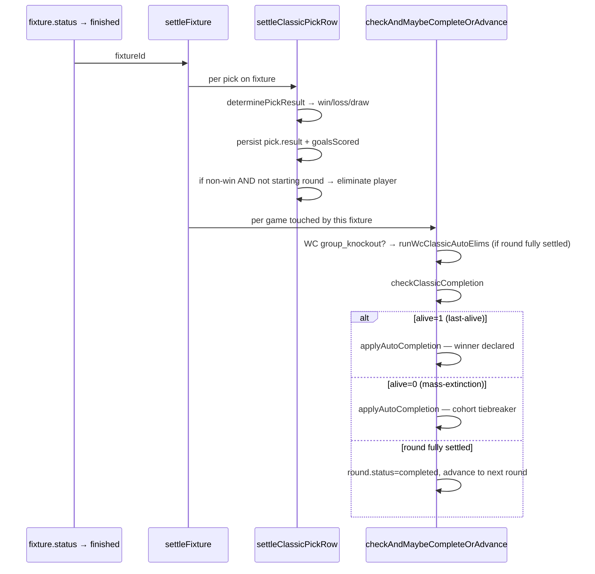
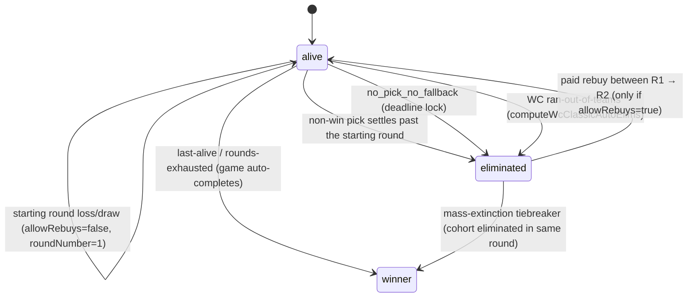

# Classic mode

Last person standing, played over **many rounds** — the only multi-round mode. One pick per round; if your team doesn't win, you're out; survive and you advance to the next round.

> Read [README.md](./README.md) first for the cross-cutting settlement model and state machines.

## Pick mechanics

- **Pick:** exactly one team per round. Stores `teamId` + `fixtureId` (so multi-fixture-per-team rounds — e.g. a PL gameweek with a rearranged Saturday match — are deterministic).
- **Win condition:** picked team wins their fixture. A draw is a loss *except* in the **starting round** (round 1 of a no-rebuys game).
- **Team re-use:** a team can only be picked once per player per game.
- **WC-specific:** picking a knockout team that's been eliminated from the tournament is invalid (`team-tournament-eliminated`). Players who run out of pickable teams in remaining rounds are auto-eliminated by `computeWcClassicAutoElims`, fired after the round's last fixture settles.

## Settlement (per fixture)

`settleFixture` (`src/lib/game/settle.ts`) dispatches each pick on the just-finished fixture through `settleClassicPickRow`:


```mermaid
sequenceDiagram
    participant Trigger as fixture.status → finished
    participant Settle as settleFixture
    participant Settle1 as settleClassicPickRow
    participant Complete as checkAndMaybeCompleteOrAdvance

    Trigger->>Settle: fixtureId
    Settle->>Settle1: per pick on fixture
    Settle1->>Settle1: determinePickResult → win/loss/draw
    Settle1->>Settle1: persist pick.result + goalsScored
    Settle1->>Settle1: if non-win AND not starting round → eliminate player
    Settle->>Complete: per game touched by this fixture
    Complete->>Complete: WC group_knockout? → runWcClassicAutoElims (if round fully settled)
    Complete->>Complete: checkClassicCompletion
    alt alive=1 (last-alive)
        Complete->>Complete: applyAutoCompletion — winner declared
    else alive=0 (mass-extinction)
        Complete->>Complete: applyAutoCompletion — cohort tiebreaker
    else round fully settled
        Complete->>Complete: round.status=completed, advance to next round
    end
```

Pick result mapping:
- `pickedTeam wins fixture` → `pick.result = 'win'`, `goalsScored = pickedTeamGoals`
- `pickedTeam loses` → `pick.result = 'loss'`, `goalsScored = 0`
- `fixture draws` → `pick.result = 'draw'`, `goalsScored = 0`. The progress grid renders draws as `draw_exempt` in the starting round (round 1, no rebuys) and as `loss` everywhere else.

## Player state machine (classic-specific)


```mermaid
stateDiagram-v2
    [*] --> alive
    alive --> alive: starting round loss/draw (allowRebuys=false, roundNumber=1)
    alive --> eliminated: non-win pick settles past the starting round
    alive --> eliminated: no_pick_no_fallback (deadline lock)
    alive --> eliminated: WC ran-out-of-teams (computeWcClassicAutoElims)
    eliminated --> alive: paid rebuy between R1 → R2 (only if allowRebuys=true)
    alive --> winner: last-alive / rounds-exhausted (game auto-completes)
    eliminated --> winner: mass-extinction tiebreaker (cohort eliminated in same round)
```

**Starting-round exemption:** `roundData.number === 1 && !allowRebuys` → losses/draws don't eliminate. Encoded in `settleClassicPickRow`.

**Mid-gameweek eliminations are real.** A player whose pick lost a Saturday fixture is `eliminated` Saturday evening, before Sunday/Monday fixtures play. The next page-view will reflect it.

**Mid-gameweek auto-completion is also real.** If a fixture's settlement drops the alive count to 1, the game auto-completes immediately — no waiting for the round to finish.

**Deferred knockout ties can't strand picks.** A knockout tie that finishes level with no `winner` reported (football-data winner-lag) leaves its pick `pending` rather than scoring a draw (`settleClassicPickRow`). Advancement is gated on those picks at BOTH advancement sites — the settle path and reconcile's `advanceGameIfReady` — even when the data source marks the round completed. If a pick was stranded anyway (the game advanced before the gates existed), the daily reconcile's all-rounds `sweepStuckFixtures` settles it once the winner lands: the elimination is applied to the round the tie belongs to, later pick rows stay untouched, and the game's current round pointer never moves backwards.

**No-pick processing runs at the deadline, not the next morning.** `processDeadlineLock` fires via a QStash `deadline_lock` job scheduled by `openRoundForGame` for deadline+30s: round 3+ no-pickers get the worst-placed unused team auto-assigned (`isAuto=true`), or are eliminated (`no_pick_no_fallback`) when every team in the round is already used; rounds 1–2 follow the rebuy rules. The daily sync remains the idempotent fallback, and the settle path's completion check runs the same lock before evaluating winners (the crown guard) — so a pickless finalist can never be crowned in the window between the last fixture settling and the next sync. See the [README's trigger surfaces](./README.md#the-deadline-no-pick-lock).

## Live projection

For an in-progress fixture (status=`live`/`halftime`, scores present):

- **Per pick:** `LivePick.projectedOutcome` is `winning` / `losing` / `drawing` based on current score.
- **Per player:** `LivePlayer.projectedStatus` is `eliminated` if any in-progress pick is currently losing AND it's past the starting round. Otherwise `alive`.
- **Cell visuals:** `getProgressGridData` projects in-progress pick cells using `projectClassicCellFromFixture`. A pick whose fixture is `live` and currently `2-0` renders as the green `'win'` cell — same visual as a settled win.

## Pick validation

`validateClassicPick` (`src/lib/picks/validate.ts:18`):
- Player must be `alive` (or `allowEliminatedRebuy=true` on the rebuy path).
- Round must be the game's current round.
- `now <= deadline` (deadline null is fine — knockout rounds pre-bracket).
- Team must not be in `usedTeamIds` for this player.
- Team must be playing in this round.

For `group_knockout` comps, also `validateWcClassicPick`: blocks picks of teams already knocked out.

## Mode config

```ts
{
  allowRebuys?: boolean // default false; if true, R1 losses can pay to re-enter
}
```

## Cancellation

When a fixture's status flips to `cancelled` (or `postponed` — auto-cancelled), `settleFixture` routes to the void path. For classic:

- **Per-pick void.** `pick.result = 'void'`, `pick.cancellation_reason = 'cancelled'`. Player stays alive. Team usage stays — the team can't be re-picked later. UI renders a distinct void cell.
- **Round-void threshold.** If, after settling a cancellation, >50% of the round's fixtures are cancelled OR >5 absolute, `voidWholeRound` fires:
  - `round.voided_at = now`, `round.status = 'completed'`.
  - Every pick on the round → `result='void'`, `cancellation_reason='round-voided'`, even previously-settled wins/losses/draws.
  - Players eliminated by this round are reinstated to `'alive'`.
  - Team usage for `round-voided` picks is filtered out at validation time — teams are released.
  - All games on this round advance via the standard flow.

See [`docs/superpowers/specs/2026-05-12-fixture-cancellation-handling-design.md`](../superpowers/specs/2026-05-12-fixture-cancellation-handling-design.md).

## Smoke coverage

`scripts/smoke/lifecycle.smoke.test.ts`, `lifecycle: classic-PL` + `lifecycle: classic-WC`:

- Single-fixture-of-many settles immediately; other picks stay pending.
- Mid-gameweek elimination (3 players, one loses on first fixture → eliminated before remaining fixtures finish).
- Mid-gameweek auto-completion (2 players, alive=1 after one fixture → game completes).
- Round advancement on last-fixture settle (3 winners → all advance).
- WC group-stage settle + advance.
- Live projection: in-progress fixture surfaces projected `'alive'` / `'eliminated'` per player + `'winning'` / `'losing'` per pick.
- Deadline no-pick lock + crown guard (`lifecycle: deadline no-pick lock + crown guard`): the Barry race (pickless finalist with no legal team eliminated before rounds-exhausted can crown), pre-deadline no-op, worst-placed-unused auto-pick at deadline time, idempotency across the QStash trigger / daily-sync fallback / crown-guard invocations.
- Stuck-pick recovery (`lifecycle: stuck-pick recovery`): reconcile refuses to advance past a deferred pending pick in a data-source-completed round; the daily sweep settles the pick once the winner lands with the elimination in the original round; stranded picks in non-current rounds self-heal without dragging the game's round pointer backwards.

Not yet covered (gaps to fill):
- WC knockout auto-elimination via `computeWcClassicAutoElims`.
- Mass-extinction tiebreaker.
- Rebuy round R1 → R2.
