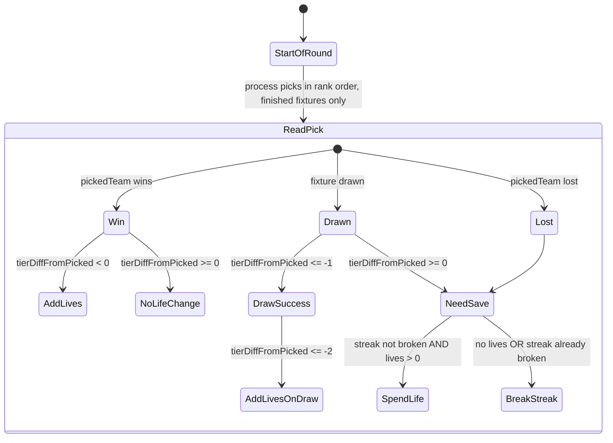
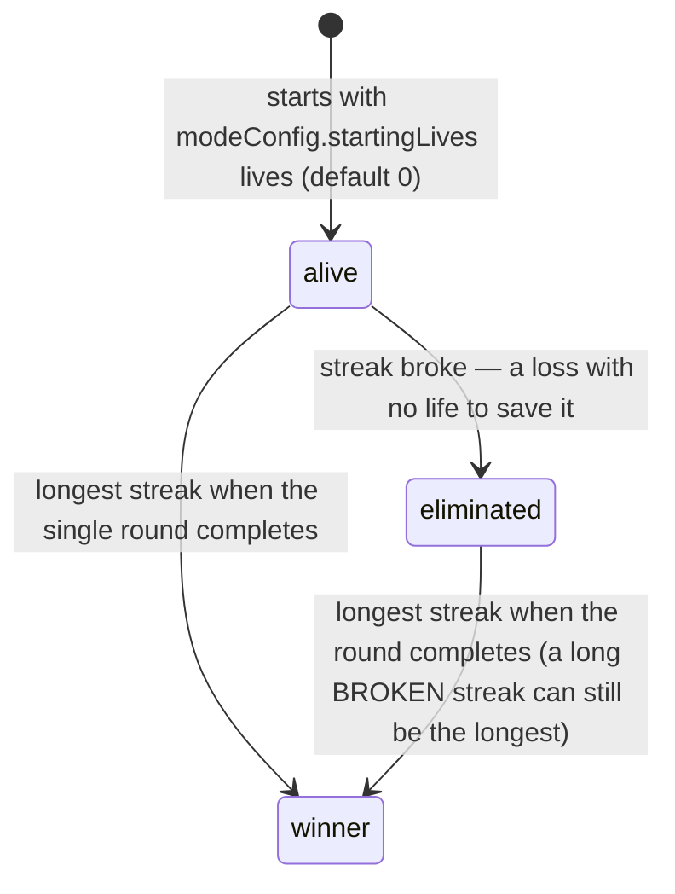

# Cup mode

**Single-round** mode — turbo plus a tier handicap and a lives system. Players rank one round's fixtures by confidence and the **longest streak** of correct picks wins. The handicap pushes you toward underdogs: a >1-tier favourite is forbidden, and beating an underdog earns lives; a life buys back one wrong call to keep your streak going. (The competition may span many rounds — group → knockout → final — but a cup *game* is bound to one; no carry-over or advancement, that's classic-only.)

> Read [README.md](./README.md) first for the cross-cutting settlement model.

## Pick mechanics

- **Picks:** up to `modeConfig.numberOfPicks` (default 10–12). Cup allows **partial rankings** — 1..N picks submittable, unlike turbo.
- **Win condition:** the **longest streak** of correct ranked picks. Once every fixture in the round is settled, players are ranked by `cupTiebreaker` (streak → lives → goals) and the longest streak takes the pot. A streak that *broke* can still win if it's the longest — the winner is whoever got furthest, not only survivors. (The edge case where **every** player breaks their streak is undecided — see the OPEN note under Settlement.)
- **Tier handicap:** every cup competition has a tier system that pushes picks toward underdogs — **where a team's tier comes from is per-competition**. `computeTierDifference` returns the difference from the home team's perspective (positive = home is the stronger side).
  - **WC (`competition.type === 'group_knockout'`):** FIFA pots (1=best, 4=worst); returns `awayPot - homePot`. Implemented.
  - **FA Cup (`competition.type === 'knockout'`):** difference in league tier (a higher-division side outranks a lower one). **Intended for the FA Cup extension (Jan 2027); not yet implemented** — `computeTierDifference` currently returns 0 for `knockout`, so a cup game on a knockout competition carries no handicap until then.
  - **`league`:** no handicap (cup mode is not offered on league competitions).

## Tier ↔ outcome table

`tierDiffFromPicked = pickedTeam === 'home' ? tierDifference : -tierDifference`

| `tierDiffFromPicked` | Meaning | Restriction / reward |
| --- | --- | --- |
| `> 1` | Picked >1 tier stronger than opponent | **Restricted** at validation |
| `1` | Picked 1 tier stronger | Allowed; goals not counted on win |
| `0` | Same tier | Allowed; standard win/loss |
| `-1` | 1-tier underdog | On win: +1 life. On draw: success, 0 lives. |
| `-2` | 2-tier underdog | On win: +2 lives. On draw: success + 1 life. |
| `-3` | 3-tier underdog (max WC) | On win: +3 lives. On draw: success + 1 life. |

`evaluateCupPicks` (`src/lib/game-logic/cup.ts`) is the evaluator.

## Settlement (whole-game re-evaluation)

Cup settlement mirrors the predecessor's `process_cup_results(p_game_id)`: when a cup fixture finishes, every game that has a pick on it gets a whole-game re-evaluation in `reevaluateCupGame`:

```mermaid
sequenceDiagram
    participant Trigger as fixture.status → finished
    participant Settle as settleFixture
    participant ReEval as reevaluateCupGame
    participant Complete as checkAndMaybeCompleteOrAdvance

    Trigger->>Settle: fixtureId
    Settle->>ReEval: per cup game touched
    Note over ReEval: For each alive player:<br/>1. Collect their picks for the current round<br/>2. Filter to picks whose fixture has scores<br/>3. Run evaluateCupPicks in rank order<br/>4. Persist per-pick: result, goalsScored,<br/>   life_gained, life_spent<br/>5. Persist gamePlayer.livesRemaining +<br/>   eliminated flag
    Settle->>Complete: per game
    Complete->>Complete: round fully settled?
    alt yes
        Complete->>Complete: checkCupCompletion → crown the LONGEST streak (cupTiebreaker)
        Complete->>Complete: applyAutoCompletion; round.status=completed; game complete
    else no
        Complete->>Complete: wait for remaining fixtures
    end
```

The winner is decided only once the round is fully settled.

The re-eval is **idempotent**: re-running it with the same fixture states produces the same writes. Picks on fixtures without scores stay `'pending'`. The streak (and any elimination from it) is **confirmed only on the contiguous settled prefix from rank 1** — evaluation stops at the first pending pick, so a lower-ranked loss can't break a streak while a higher-confidence pick is still unplayed. The live UI still *projects* those later results; only confirmed state is finalised. Once the streak is confirmed broken, later settled picks persist as `'loss'`.

> **OPEN (code session owns this):** what happens when **every** player breaks their streak in the round (no survivor) — e.g. everyone's most-confident pick loses — is an undecided design question: **no winner + full refund** vs **best-tiebreaker-takes-the-pot** (the longest, possibly zero, streak wins on lives/goals). This was the `d8360e69` incident. Do NOT encode a resolution here until it's settled in the engine.

Persisted bookkeeping (new columns introduced with this design):

- `pick.life_gained: int` — lives awarded to the player for this pick (0 for non-cup or no-bonus cases).
- `pick.life_spent: boolean` — true when this pick was saved by a life.

Both replace the old read-time recompute in `cup-standings-queries.computeLivesGained/Spent`. The helpers now read the persisted columns.

## Lives flow



Once `streakBroken=true`, every subsequent pick in rank order is a `'loss'` regardless of result. Lives spent earlier remain spent.

## Player state machine



Lives are **earned**, not handed out — `startingLives` defaults to 0. The creator can raise it for a more forgiving game.

## Live projection

For in-progress fixtures:

- **Per pick:** `LivePick.projectedOutcome` is `winning` / `drawing` / `losing` based on current score.
- **Per player:** `LivePlayer.projectedStreak` / `projectedLivesRemaining` / `projectedStatus` come from running `evaluateCupPicks` over `(settled picks ∪ in-progress picks with current scores)`. The aggregate updates live as scores change.
- **Cell visuals:** `cup-standings-queries.projectCupCellFromFixture` projects the per-pick cell colour from current scores using the simple win/loss/draw mapping. Cup-specific saved_by_life / draw_success outcomes only appear post-settlement (they need streak/lives context).

## Game-creation guard

Cup mode on `group_knockout` competitions requires every team to carry an `external_ids.fifa_pot`. Game creation refuses if any team is missing — without it `computeTierDifference` silently returns 0, breaking the lives mechanic across the board. See `/api/games/route.ts`.

## Pick validation

`validateCupPicks` (`src/lib/picks/validate.ts:72`):
- Player must be `alive`.
- Round must be the game's current round.
- `now <= deadline`.
- 1 ≤ picks ≤ `numberOfPicks` — **partial rankings allowed**.
- Fixtures unique; ranks 1..picks.length contiguous from 1.
- Per pick: `tierDiffFromPicked` ≤ 1 — `>1` (huge favourite) is rejected.

## Mode config

```ts
{
  numberOfPicks?: number  // max picks per round, partial rankings allowed
  startingLives?: number  // default 0 — lives are earned, not handed out
}
```

## Cancellation

When a cup pick's fixture is cancelled, `pick.result = 'void'`, `life_gained=0`, `life_spent=false`. The whole-game re-eval (`reevaluateCupGame`) iterates rank-ordered and explicitly skips voided picks. Streak/lives state at the next rank picks up from the previous non-voided rank — voided picks contribute nothing positive or negative.

No automatic round-void in cup; admin refunds via the existing endpoint if needed.

See [`docs/superpowers/specs/2026-05-12-fixture-cancellation-handling-design.md`](../superpowers/specs/2026-05-12-fixture-cancellation-handling-design.md).

## Smoke coverage

`scripts/smoke/lifecycle.smoke.test.ts`, `lifecycle: cup-WC`:

- 3-tier underdog wins → +3 lives persisted on the pick, `gamePlayer.livesRemaining` updated.
- Re-eval idempotency: settling the same fixture twice produces the same state.

Not yet covered:
- 1-tier and 2-tier underdog wins.
- Draw success / saved-by-life paths end-to-end.
- Streak-broken state propagating across remaining picks.
- Cup mode on `knockout` competition (FA Cup) — confirms tier-diff=0 path.
- Cup pick on a fixture that finishes out of confidence-rank order (re-eval correctness).
