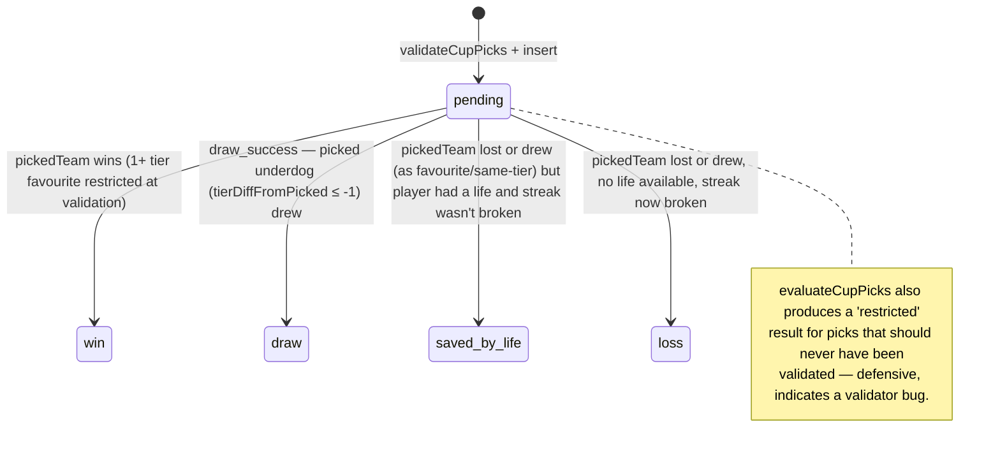
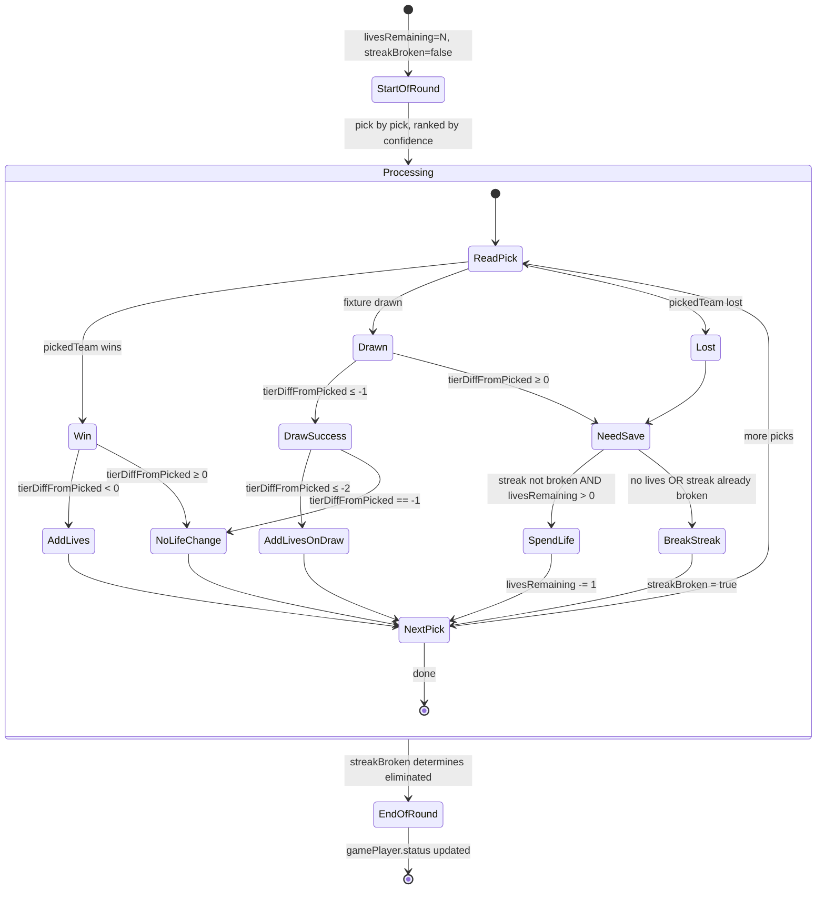
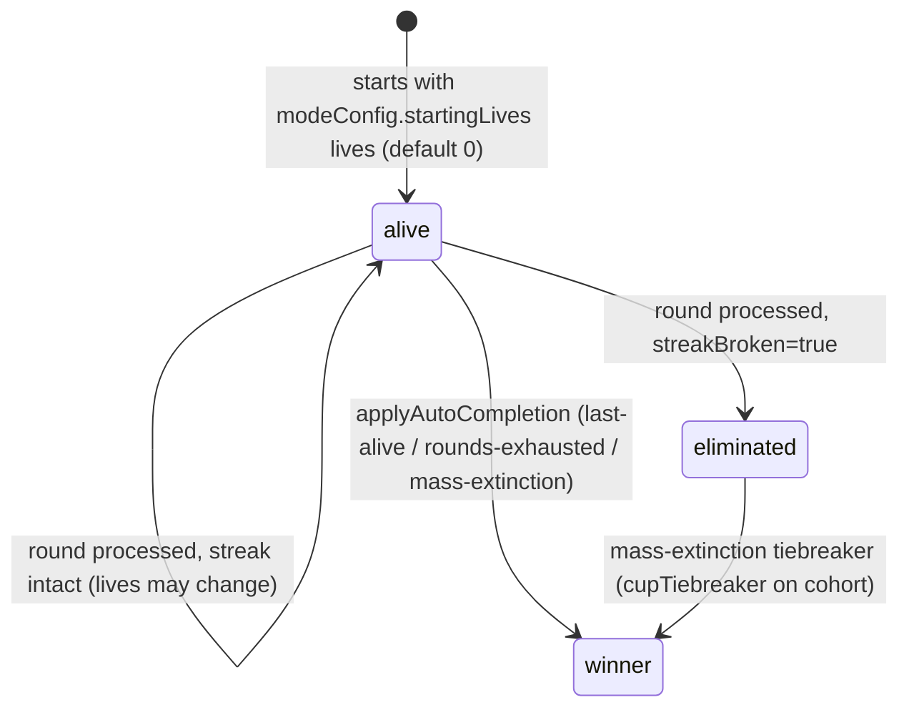
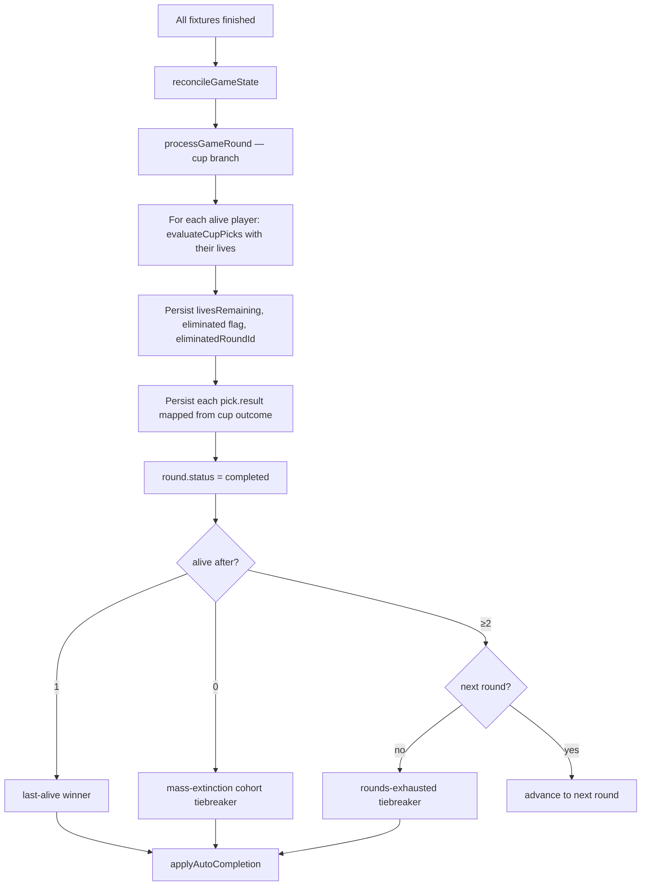

# Cup mode

Tier-handicapped predictions with a lives system. Players rank cup fixtures by confidence; picking the underdog earns lives on a win, picking a >1-tier favourite is forbidden, and lives let you survive an occasional wrong call.

> Read [README.md](./README.md) first for the cross-cutting state machines.

## Game shape

- **Picks:** up to `modeConfig.numberOfPicks` (default whatever the creator chose, typically 10–12). Cup allows **partial rankings** — players can submit fewer than the max (unlike turbo, which requires the full count).
- **Round:** any cup-competition round (WC group / R16 / QF / SF / F; FA Cup rounds; etc.).
- **Win condition:** survive every round until the last round, then ranked by tiebreaker (`cupTiebreaker`).
- **Tier handicap:** group-stage WC fixtures (`competition.type === 'group_knockout'`) carry a tier difference based on FIFA pots (1 = strongest, 4 = weakest). `computeTierDifference` returns `awayPot - homePot` so positive = home stronger. Non-group_knockout cup competitions (e.g. FA Cup `type='knockout'`) return 0 — no handicap applies.

## Tier mechanics

`tierDifference` is from the home team's perspective. From the picked team's perspective:

```
tierDiffFromPicked = pickedTeam === 'home' ? tierDifference : -tierDifference
```

| `tierDiffFromPicked` | Meaning | Restrictions / rewards |
| --- | --- | --- |
| `> 1` | Picked team is >1 tier stronger than opponent | **Restricted** — invalid pick |
| `1` | Picked 1 tier stronger | Allowed. Goals not counted on win (no tiebreaker benefit). No lives gained. |
| `0` | Same tier | Allowed. Standard win/loss. |
| `-1` | Picked 1 tier weaker (underdog) | On win: gain 1 life. On draw: success (no elimination), 0 lives. |
| `-2` | Picked 2 tiers weaker | On win: gain 2 lives. On draw: success + gain 1 life. |
| `-3` | Picked 3 tiers weaker (max for WC) | On win: gain 3 lives. On draw: success + gain 1 life. |

`evaluateCupPicks` (`src/lib/game-logic/cup.ts:23`) is the authority.

## Pick state machine



The DB `pickResultEnum` maps cup outcomes as: `win`, `draw` (draw_success), `saved_by_life`, `loss` (loss + restricted both fall here). See `process-round.ts:326-333`.

## Lives system



Key invariant: once `streakBroken=true`, every subsequent pick (regardless of result) is a `loss`. Lives spent earlier on saves remain spent.

## Player state machine (cup-specific)



Lives are **earned**, not handed out — the default is `startingLives: 0`. The creator can raise it for a more forgiving game.

## Round lifecycle

`processGameRound` for cup (`src/lib/game/process-round.ts:284-359`):

1. For each alive player: evaluate via `evaluateCupPicks` with the player's `livesRemaining` as the starting lives.
2. Persist `livesRemaining = result.finalLives`. If `result.eliminated`, set `status='eliminated'` and `eliminatedRoundId`.
3. Persist each pick's mapped `pick.result` + `goalsScored`.
4. Mark `round.status = 'completed'`.
5. `checkCupCompletion`: same shape as classic (last-alive / mass-extinction / rounds-exhausted / advance).



## Pick validation

`validateCupPicks` (`src/lib/picks/validate.ts:72`):

- Player must be `alive` (or `allowEliminatedRebuy=true`).
- Round must be the game's current round.
- `now <= deadline`.
- 1 ≤ submitted picks ≤ `numberOfPicks` — **partial rankings allowed** (the only mode that does).
- All fixtures unique within submission.
- Ranks must be 1..picks.length contiguous starting from 1.
- For each pick, `tierDiffFromPicked` must be ≤ 1 — picking a >1-tier favourite is rejected by the validator.

Game creation refuses to start a cup game on a `group_knockout` competition if any team in the comp is missing `external_ids.fifa_pot` (`src/app/api/games/route.ts`). This is the runtime gate that prevents tier-diff from silently returning 0 across the board.

## Mode config

```ts
{
  numberOfPicks?: number  // max picks per round, partial rankings allowed
  startingLives?: number  // default 0 — lives are earned, not handed out
}
```

## Group_knockout vs knockout

`computeTierDifference` returns 0 for any non-`group_knockout` cup competition. So cup mode on FA Cup / League Cup (`type='knockout'`) behaves as cup-without-tier-handicaps: every pick is "same tier" and there's no lives mechanic beyond `startingLives`. The validator's >1 check is also dormant (everything is 0).

This is intentional — cup mode is "the format" (lives, ranked picks, draws-can-survive) and tier-diff is the WC-specific seasoning. Other cup competitions can opt in by introducing their own tier marker in the future.

## Smoke coverage

`scripts/smoke/lifecycle.smoke.test.ts` — `lifecycle: cup-WC`:

- "awards lives on underdog win, restricts favourite picks" — 3-tier upset (Cape Verde over Spain) yields +3 lives, even-tier picks neutral, hero survives with 3 lives.
- "eliminates on streak break with no lives" — same-tier loss with no lives → eliminated.

Not yet covered:

- 1-tier underdog win → +1 life.
- Draw-success on -1 picks (no lives gained).
- Draw-success on -2/-3 picks (+1 life).
- Saved-by-life mechanic with multiple consecutive losses.
- Streak-broken state propagating across remaining picks.
- Cup mode on `knockout` competition (FA Cup) — confirms tier-diff=0 path.
- Multi-round cup with advancement.
