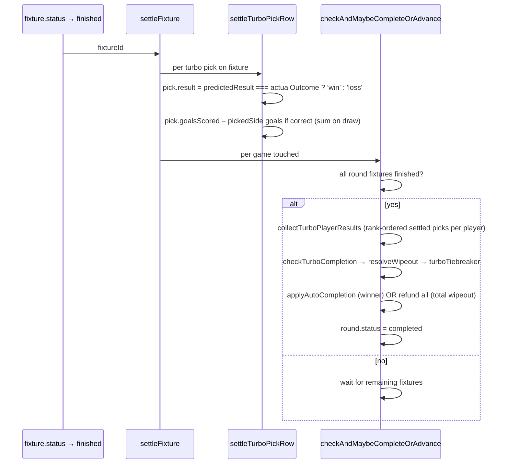

# Turbo mode

Predict N fixtures (default 10) in a single round, ranked by confidence. Longest streak wins. Single-round format — the game auto-completes when the round is fully settled.

> Read [README.md](./README.md) first for the cross-cutting settlement model.

## Pick mechanics

- **Picks:** exactly `modeConfig.numberOfPicks` (default 10) — submitted in one request, no partial rankings.
  - `predictedResult`: `home_win` / `draw` / `away_win`
  - `confidenceRank`: 1..N, no duplicates, no gaps
- **Win condition:** longest streak of correct predictions sorted by rank ascending — first wrong prediction ends the streak; later corrects don't count. Leading ranks that **everyone** got wrong are skipped first (the wipeout rule, under Settlement), so the streak count restarts from the first rank anyone got right.
- **Tiebreaker:** longest streak first, then total goals in streak. Turbo has no lives — goals are the only tiebreak.

## Settlement (per fixture)

Each fixture transition settles its turbo picks immediately:



**Per-fixture settle, round-batched completion.** A turbo pick is settled (`win` or `loss`) the moment its fixture finishes. The round completion + winner determination wait for every fixture in the round to be settled — turbo's streak is rank-ordered across all picks.

### Wipeout rule (winner determination)

`checkTurboCompletion` applies the same wipeout rule as cup (`resolveWipeout`), minus lives:

- **Skip leading universal-loss ranks.** If rank 1 was wrong for *every* player it's discarded and the streak count restarts from rank 2 (and so on — the rebased start is the lowest rank any player got right). Each player's streak is the consecutive run of correct picks from that start.
- **Total wipeout → full refund.** If *no* rank has a single correct pick anywhere, there's no winner: the game completes with `reason: 'turbo-total-wipeout'`, every stake is refunded (`payment.status = 'refunded'`), and no payout is written.
- **Tiebreak is goals only** (no lives mechanic in turbo): rebased streak → goals-in-streak.

## Player state machine

```mermaid
stateDiagram-v2
    [*] --> alive
    alive --> winner: applyAutoCompletion (turbo-single-round; turboTiebreaker selects winners)
    alive --> alive: total wipeout — no winner, every stake refunded
    note right of winner
        Turbo never eliminates mid-round.
        Multiple winners possible on perfect tie (split pot).
        On a total wipeout there is no winner: players stay alive,
        the game completes, and all payments are refunded.
    end note
```



## Live projection

For an in-progress fixture:

- **Per pick:** `LivePick.projectedOutcome` is `winning` (current actual outcome matches the prediction) or `losing` (doesn't).
- **Per player:** `LivePlayer.projectedStreak` walks the player's picks in rank order, counting in-progress ones that are currently correct. Stops at the first projected incorrect pick. `getTurboStandingsData` also returns `streak` + `goals` that include in-progress projection — open-round views update live.
- **Cell visuals:** turbo ladder cells use the same `'win'` / `'loss'` rendering for projection as for settled. The pulsing `LIVE` / `HT` indicator on the fixture card communicates that the result isn't final.

## Pick validation

`validateTurboPicks` (`src/lib/picks/validate.ts:120`):
- Player must be `alive`.
- Round must be the game's current round.
- `now <= deadline`.
- **Exactly `numberOfPicks` picks** — no partial rankings (unlike cup).
- Fixtures unique; ranks 1..N contiguous, no gaps.

## Mode config

```ts
{
  numberOfPicks?: number // default 10
}
```

## Cancellation

When a turbo pick's fixture is cancelled, `pick.result = 'void'` and the streak evaluator walks past it as if it weren't in the input. A 10-pick turbo with one cancelled fixture effectively becomes a 9-pick game — the streak counts ranks 1..(k-1) plus rank (k+1)..N, skipping the voided rank entirely.

No automatic round-void in turbo; admin refunds via the existing endpoint if the situation calls for it.

See [`docs/superpowers/specs/2026-05-12-fixture-cancellation-handling-design.md`](../superpowers/specs/2026-05-12-fixture-cancellation-handling-design.md).

## Smoke coverage

`scripts/smoke/lifecycle.smoke.test.ts`, `lifecycle: turbo-PL`:

- Per-fixture settle: pick 1 settles after fx1; pick 2 stays pending; game stays active. Then pick 2 settles after fx2 → game auto-completes.
- Total wipeout: every player's only pick is wrong → game completes, no winner, no payout, every `payment` refunded.

Not yet covered:
- Multi-player turbo with split pot on tied streaks.
- All-correct streak (longest possible).
- Leading universal-loss rank skipped (turbo rebase — covered by unit tests + the cup smoke scenario, which share `resolveWipeout`).
