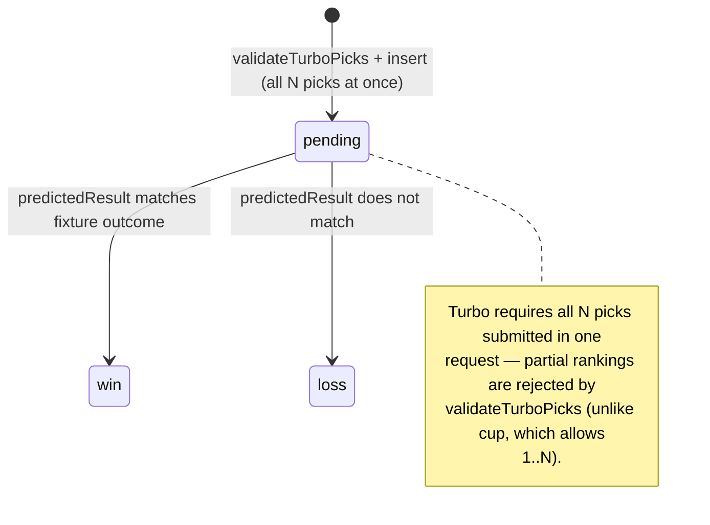
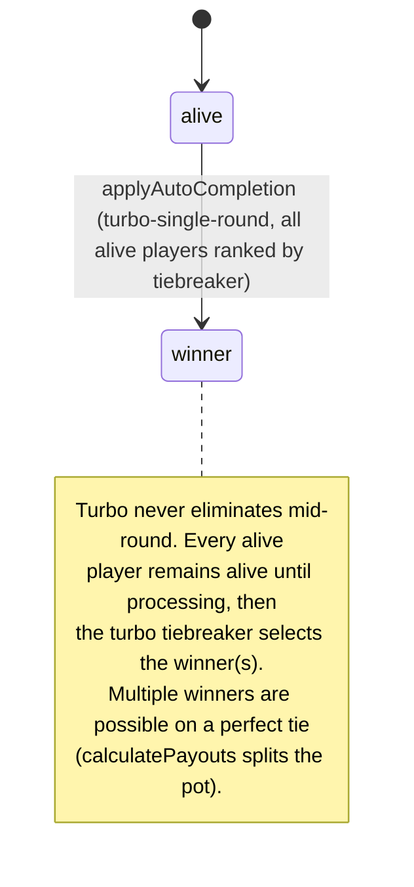
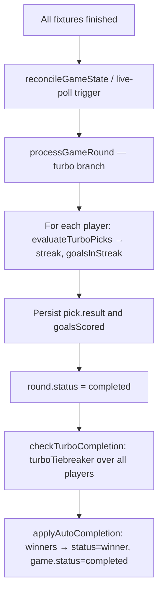

# Turbo mode

Predict ten fixtures in a single round, ranked by confidence. Highest streak wins. Single-round format — the game auto-completes when the one round is processed.

> Read [README.md](./README.md) first for the cross-cutting state machines.

## Game shape

- **Picks:** exactly `modeConfig.numberOfPicks` predictions (default 10), each on a different fixture in the same round. Each pick has:
  - `predictedResult`: `home_win` / `draw` / `away_win`
  - `confidenceRank`: 1..N, no duplicates, no gaps
- **Round:** one round per game. After it processes, the game completes.
- **Win condition:** highest streak — the longest prefix of correct predictions when sorted by confidence rank ascending. First wrong prediction ends the streak; later correct ones don't count.
- **Tiebreaker:** longest streak first, then total goals in the streak (`calculateTurboStandings` orders standings the same way; `turboTiebreaker` selects winners).

## Pick state machine



Set inside `evaluateTurboPicks` (`src/lib/game-logic/turbo.ts:16`). The persisted pick result is `'win'` or `'loss'` (`processGameRound:263`). Draws on a `draw` prediction count as `'win'`; draws on a non-`draw` prediction count as `'loss'`.

## Player state machine (turbo-specific)



## Round lifecycle

Single round, then auto-complete. `processGameRound` for turbo (`src/lib/game/process-round.ts:233-282`):

1. For each alive player: evaluate their picks via `evaluateTurboPicks`, persist `pick.result` ('win'/'loss') and `pick.goalsScored`.
2. Mark `round.status = 'completed'`.
3. **Always** call `applyAutoCompletion` with `checkTurboCompletion`'s winners — turbo never advances to a next round.



## Game auto-completion conditions

Always — single-round format. `checkTurboCompletion` always returns `completed: true` with `winnerPlayerIds` from `turboTiebreaker` (`src/lib/game-logic/auto-complete-tiebreakers.ts`).

## Pick validation

`validateTurboPicks` (`src/lib/picks/validate.ts:120`):

- Player must be `alive` (or `allowEliminatedRebuy=true`).
- Round must be the game's current round.
- `now <= deadline`.
- Must submit exactly `numberOfPicks` picks — no partial rankings (unlike cup).
- All fixtures unique, all confidence ranks 1..N with no duplicates or gaps.
- Every fixture must be in the round.

## Mode config

```ts
{
  numberOfPicks?: number // default 10
}
```

## Smoke coverage

`scripts/smoke/lifecycle.smoke.test.ts` — `lifecycle: turbo-PL` + `lifecycle: turbo-WC`:

- "processes 10-pick streak and auto-completes (single-round mode)" — 10 picks, streak breaks at pick 7, asserts `game.status === 'completed'`.
- "processes 10-pick turbo on WC group stage" — same on a `group_knockout` competition.

Not yet covered:

- Multi-player turbo with split pot on tied streaks.
- All-correct streak (longest possible).
- Streak-break-at-rank-1 (zero streak).
